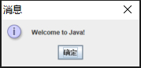
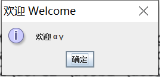

# Java语言程序设计-基础篇
## chapter01
### 1.7 一个简单的java程序
> //程序清单1-1 Welcome.java
```java
public class Welcome {
    public static void main(String[] args) {
        //Display message Welcome to Java! to the console
        System.out.println("Welcome to Java!");
    }
}
```
- 编译运行程序(Windows平台)
```
javac .\Welcome.java
java Welcome
```

`Welcome to Java!`

- 第2行定义了一个类。每个Java程序至少应该有一个类。每个类都有一个名字。按照惯例，类名都是以大写字母开头的。
- 第3行定义主方法(main method)。为了运行某个类，该类必须包含名为main的方法。程序是从main方法开始执行的。

> 程序清单1-2 Welcome1.java
```java
public class Welcome1 {
    public static void main(String[] args) {
        System.out.println("Programming is fun!");
        System.out.println("Fundamentals First");
        System.out.println("Problem Driven");
    }
}
```
反馈
```sh
Programming is fun!
Fundamentals First
Problem Driven
```
> 程序清单1-3 ComputeExpression.java
```java
public class ComputeExpression {
    public static void main(String [] main) {
        System.out.println((10.5 + 2 * 3) / (45 - 3.5));
    }
}
```
反馈
```sh
0.39759036144578314
```

- 1.8 创建、编译和执行Java程序<br>
笔记(略)
- 1.9 (GUI)在消息对话框中显示文本
> 程序清单1-4 WelcomeInMessageDialogBox.java
```java
//This application program displays Welcome to Java! in a message dialog box.
import javax.swing.JOptionPane;

public class WelcomeInMessageDialogBox {
    public static void main(String[] args){
        //Display Welcome to Java! in a message dialog box
        JOptionPane.showMessageDialog(null, "Welcome to Java!");
    }
}
```
反馈<br>


### 编程练习题
- 略

## chapter02 基本程序设计
> 程序清单2-1 ComputeArea.java
```java
public class ComputeArea {
    public static void main(String[] args) {
        double radius;
        double area;

        //Assign a radius
        radius = 20;

        //Compute area
        area = radius * radius * 3.14159;

        //Display results
        System.out.println("The area for the circle of radius " + radius + " is " + area);
    }
}
```
### 2.3 从控制台读取输入
> 程序清单2-2 ComputeAreaWithConsoleInput.java
```java
import java.util.Scanner;

public class ComputeAreaWithConsoleInput {
    public static void main(String[] args) {
        //Create a Scanner object
        Scanner input = new Scanner(System.in);

        //Prompt the user to enter a radius
        System.out.print("Enter a number for radius: ");
        double radius = input.nextDouble();

        //Compute area
        double area = radius * radius * 3.14159;

        //Display result
        System.out.println("The area for the circle of radius " + radius + " is " + area);

        //Close input
        input.close();;
    }
}
```
反馈
```sh
Enter a number for radius: 20
The area for the circle of radius 20.0 is 1256.636
```
- `System.out.print("Enter a number for radius: ")`print方法和println方法类似，两者不同之处在于：当显示完字符串之后，println会将贯标移到下一行，而print不会将光标移到下一行。

> 程序清单2-3 ComputeAverage.java
```java
import java.util.Scanner;

public class ComputeAverage {
    public static void main(String[] args) {
        //Create a Scanner object
        Scanner input = new Scanner(System.in);

        //Prompt the user to enter three numbers
        System.out.print("Enter three number: ");
        double number1 = input.nextDouble();
        double number2 = input.nextDouble();
        double number3 = input.nextDouble();

        //Compute average
        double average = (number1 + number2 + number3) / 3;

        //Display result
        System.out.println("The average of " + number1 + " " + number2 + " " + number3 + " is " +
                            average);
        
        //Input close
        input.close();
    }
}
```
反馈
```sh
Enter three number: 1 2 3
The average of 1.0 2.0 3.0 is 2.0
```
### 2.4 标识符
- 标识符必须遵循一下规则：
    - 标识符是由字母、数字、下划线(_)和美元符号($)构成的字符序列
    - 标识符必须以字母、下划线(_)或美元符号($)开头，不能以数字开头
    - 标识符不能是关键字
    - 标识符不能是true、false或null
    - 标识符可以为任意长度
- 提示
    - 标识符是为了命名变量、常量、方法、类和包。描述性的标识符可提高程序的可读性
    - 不要用字符$命名标识符。习惯上，字符$只用在机器自动产生的源代码中

### 2.5 变量
### 2.6 赋值语句和赋值表达式
### 2.7 常量
`final datatype CONSTANTNAME = VALUE`
### 2.8 数值数据类型及运算
<table border="1"  width="700px" cellspacing="0px">
  <thead align="center">
    <td>类型名</td>
    <td>范围</td>
    <td width="200px">存储大小</td>
  </thead>
  <tbody></tbody>
  <tr>
    <td>byte</td>
    <td>-2<sup>7</sup>(-128) ~ 2<sup>7</sup>-1(127)</td>
    <td>8位带符号数</td>
  </tr>
  <tr>
    <td>short</td>
    <td>-2<sup>15</sup>(-32768) ~ 2<sup>15</sup>-1(32767)</td>
    <td>16位带符号数</td>
  </tr>
  <tr>
    <td>int</td>
    <td>-2<sup>31</sup>(-2147483648) ~ 2<sup>31</sup>-1(2147483647)</td>
    <td>32位带符号数</td>
  </tr>
  <tr>
    <td>long</td>
    <td>-2<sup>63</sup>(-9223372036854775808) ~ 2<sup>63</sup>-1(9223372036854775807)</td>
    <td>64位带符号数</td>
  </tr>
  <tr>
    <td>float</td>
    <td>负数范围:-3.4028235E+38 ~ -1.4E-45<br>正数范围:1.4E-45 ~ 3.4028235E+38</td>
    <td>32位，标准IEEE 754</td>
  </tr>
  <tr>
    <td>double</td>
    <td>负数范围:-1.7976931348623157E+308 ~ -4.9E-324<br>正数范围:4.9E-324 ~ 1.7976931348623157E+308</td>
    <td>64位，标准IEEE 754</td>
  </tr>

</table>

> 程序清单2-4 DisplayTime.java
```java
import java.util.Scanner;

public class DisplayTime {
    public static void main(String[] args) {
        Scanner input = new Scanner(System.in);
        //Prompt the user for input
        System.out.print("Enter an integer of seconds: ");
        int seconds = input.nextInt();

        int minutes = seconds / 60; // Find minutes in seconds
        int remainingSeconds = seconds % 60; // Seconds remaining
        System.out.println(seconds + " seconds is " + minutes + " minutes and " + 
                remainingSeconds + " seconds");
        input.close();
    }    
}
```
反馈
```sh
Enter an integer of seconds: 200
200 seconds is 3 minutes and 20 seconds
```
> 程序清单2-5 FahrenheitToCelsius.java
```java
import java.util.Scanner;

public class FahrenheitToCelsius {
    public static void main(String[] args) {
        Scanner input = new Scanner(System.in);

        System.out.print("Enter a degree in Fahrenheit: ");
        double fahrenheit = input.nextDouble();

        //Convert Fahrenheit to Celsius
        double celsius = (5.0 / 9) * (fahrenheit - 32);
        System.out.println("Fahrenheit " + fahrenheit + " is " + celsius + " in Celsius");
        input.close();;
    }
}
```
反馈
```sh
Enter a degree in Fahrenheit: 100
Fahrenheit 100.0 is 37.77777777777778 in Celsius
```
### 问题：显示当前时间
>程序清单2-6 
```java
public class ShowCurrentTime {
    public static void main(String[] args) {
        //Obtain the total milliseconds since midnight, Jan 1, 1970
        long totalMilliseconds = System.currentTimeMillis();

        //Obtain the total seconds since midnight, Jan 1, 1970
        long totalSeconds = totalMilliseconds / 1000;

        //Compute the current second in the minute in the hour
        long currentSecond = totalSeconds % 60;

        //Obtain the total minutes
        long totalMinutes = totalSeconds / 60;

        //Compute the current minute in the hour
        long currentMinute = totalMinutes % 60;

        //Obtain the total hours
        long totalHours = totalMinutes / 60;

        //Compute the current hour
        long currentHour = totalHours % 24;
        //East 8th District
        currentHour += 8;

        //Display results
        System.out.println("Current time is " + currentHour + ":" + currentMinute
            + ":" + currentSecond + " GMT");
    }
}
```
反馈
```sh
Current time is 13:9:44 GMT
```
### 2.11 数值类型转换
> 程序清单2-7 SalesTax.java
```java
import java.util.Scanner;

public class SalesTax {
    public static void main(String[] args) {
        Scanner input = new Scanner(System.in);

        System.out.print("Enter purchase amount: ");
        double purchaseAmount = input.nextDouble();

        double tax = purchaseAmount * 0.06;
        System.out.println("Sales tax is " + (int)(tax * 100) / 100.0);

        input.close();
    }    
}
```
反馈
```sh
Enter purchase amount: 197.55
Sales tax is 11.85
```
> 程序清单2-8 
```java
public class ComputeLoan {
    public static void main(String[] args) {
        //Create a Scanner
        Scanner input = new Scanner(System.in);

        //Enter yearly interest rate
        System.out.print("Enter yearly interest rate, for example 8.25: ");
        double annualInterestRate = input.nextDouble();

        //Obtain monthly interest rate
        double monthlyInterestRate = annualInterestRate / 1200;

        //Enter number of years
        System.out.print("Enter number of years as an integer, for example 5: ");
        int numberOfYears = input.nextInt();

        //Enter loan amount
        System.out.print("Enter loan amount, for example 120000.95: ");
        double loanAmount = input.nextDouble();

        //Calculate payment
        double monthlyPayment = loanAmount * monthlyInterestRate / (1 - 1 / Math.pow(1 +
            monthlyInterestRate, numberOfYears * 12));
        double totalPayment = monthlyPayment * numberOfYears * 12;

        //Display results
        System.out.println("The monthly payment is " + (int)(monthlyPayment * 100) / 100.0);
        System.out.println("The total payment is " + (int)(totalPayment * 100) / 100.0);

        input.close();
    }
}
```
反馈
```sh
Enter yearly interest rate, for example 8.25: 5.75
Enter number of years as an integer, for example 5: 15
Enter loan amount, for example 120000.95: 250000
The monthly payment is 2076.02
The total payment is 373684.53
```
### 2.13 字符数据类型及运算
> 程序清单2-9 DisplayUnicode.java
```java
import javax.swing.JOptionPane;

public class DisplayUnicode {
    public static void main(String[] args) {
        JOptionPane.showMessageDialog(null, "\u6B22\u8FCE \u03b1 \u03b3", 
            "\u6B22\u8FCE Welcome", JOptionPane.INFORMATION_MESSAGE);
    }
}
```
反馈

### 2.14 问题：挣钱兑零
略
### 2.15 String类型
### 2.16 程序设计风格和文档
- 命名习惯
    - 使用小写字母命名变量和方法。如果一个名字包含多个单词，就将它们连在一起，第一个单词的字母小写，而后面的每个单词的首字母大写；
    - 类名中的每个单词的首字母大写；
    - 大写常量中的所有字母，两个单词间用下划线连接，例如：`MAX_VALUE`
### 2.17 程序设计错误
- 语法错误
- 运行错误
- 逻辑错误
### 2.18 (GUI)从输入对话框获取输入
> 程序清单2-11 
```java
import javax.swing.JOptionPane;

public class ComputeLoanUsingInputDialog {
    public static void main(String[] args) {
        //Enter yearly interest rate
        String annualInterestRateString = JOptionPane.showInputDialog(
            "Enter yearly interest rate, for example 8.25:");
        
        //Convert string to double
        double annualInterestRate = Double.parseDouble(annualInterestRateString);

        //Obtain monthly interest rate
        double monthlyInterestRate = annualInterestRate / 1200;

        //Enter number of years
        String numberOfYearsString = JOptionPane.showInputDialog(
            "Enter number of years as an integer, \nfor example 5:");
        
        //Convert string to int
        int numberOfYears = Integer.parseInt(numberOfYearsString);

        //Enter loan amount
        String loanString = JOptionPane.showInputDialog(
            "Enter loan amount, for example 120000.95:");
        
        //Convert string to double
        double loanAmount = Double.parseDouble(loanString);

        //Calculate payment
        double monthlyPayment = loanAmount * monthlyInterestRate / (1
            - 1 / Math.pow(1 + monthlyInterestRate, numberOfYears * 12));
        double totalPayment = monthlyPayment * numberOfYears * 12;

        //Format to keep two digits after the decimal point
        monthlyPayment = (int)(monthlyPayment * 100) / 100.0;
        totalPayment = (int)(totalPayment * 100) / 100.0;

        //Display results
        String output = "The monthly payment is " + monthlyPayment +
            "\nThe total payment is " + totalPayment;
        JOptionPane.showMessageDialog(null, output);
    }
}
```
反馈<br>略
## 第3章 选择
程序清单3-1 AdditionQuiz.java
```java
import java.util.Scanner;

public class AdditionQuiz {
    public static void main(String[] args) {
        int number1 = (int)(System.currentTimeMillis() % 10);
        int number2 = (int)(System.currentTimeMillis() * 7 % 10);

        // Create a Scanner
        Scanner input = new Scanner(System.in);

        System.out.print("What is " + number1 + " + " + number2 + "? ");

        int answer = input.nextInt();

        System.out.println(number1 + " + " + number2 + " = " + answer +
            " is " + (number1 + number2 == answer));

        input.close();
    }
}
```
反馈
```sh
What is 1 + 7? 6
1 + 7 = 6 is false
```
> 程序清单3-2 SimpleIfDemo.java
```java
import java.util.Scanner;

public class SimpleIfDemo {
    public static void main(String[] args) {
        Scanner input = new Scanner(System.in);
        System.out.println("Enter an integer: ");
        int number = input.nextInt();

        if(number % 5 == 0)
            System.out.println("HiFive");

        if(number % 2 == 0)
            System.out.println("HiEven");
        
        input.close();
    }
}
```
反馈
```sh
Enter an integer:
4
HiEven
```
## chapter04 循环
`todo`
## chapter05 方法
`todo`
## chapter06 一维数组
`todo`
## chapter07 多维数组
`todo`
## chapter08 对象和类
### 8.3 举例：定义类和创建对象
> 程序清单8-1 TestCircle1.java
```java
//Define the circle class with two constructors
class Circle1 {
    double radius;

    /* Construct a circle with radius 1 */
    Circle1() {
        radius = 1.0;
    }

    /* Construct a circle with a specified radius */
    Circle1(double newRadius) {
        radius = newRadius;
    }

    /* Return the area of this circle */
    double getArea() {
        return radius * radius * Math.PI;
    }
}

public class TestCircle1 {
    public static void main(String[] args) {
        //Create a circle with radius 1.0
        Circle1 circle1 = new Circle1();
        System.out.println("The area of the circle of radius "
            + circle1.radius + " is " + circle1.getArea());
        
        //Create a circle with radiu 25
        Circle1 circle2 = new Circle1(25);
        System.out.println("The are of the circle of radius "
            + circle2.radius + " is " + circle2.getArea());
        
        //Create a circle with radius 125
        Circle1 circle3 = new Circle1(125);
        System.out.println("The are of the circle of radius "
            + circle3.radius + " is " + circle3.getArea());
        
        //Modify circle radius
        circle2.radius = 100;
        System.out.println("The are of the circle of radius "
            + circle2.radius + " is " + circle2.getArea());
    }
}
```
反馈
```sh
The area of the circle of radius 1.0 is 3.141592653589793
The are of the circle of radius 25.0 is 1963.4954084936207
The are of the circle of radius 125.0 is 49087.385212340516
The are of the circle of radius 100.0 is 31415.926535897932
```

> 程序清单8-3 TV.java
```java
public class TV {
    int channel = 1;
    int volumeLevel = 1;
    boolean on = false;

    public TV() {
    }

    public void turnOn() {
        on = true;
    }

    public void turnOff() {
        on = false;
    }

    public void setChannel(int newChannel) {
        if(on && newChannel >= 1 && newChannel <= 120)
            channel = newChannel;
    }

    public void setVolume(int newVolumeLevel) {
        if(on && newVolumeLevel >= 1 && newVolumeLevel <= 7)
            volumeLevel = newVolumeLevel;
    }

    public void channelUp() {
        if(on && channel < 120)
            channel++;
    }

    public void channelDown() {
        if(on && channel > 1)
            channel--;
    }

    public void volumeUp() {
        if(on && volumeLevel < 7)
            volumeLevel++;
    }

    public void volumeDown() {
        if(on && volumeLevel > 1)
            volumeLevel--;
    }
}
```
> 程序清单8-4 TestTv.java
```java
public class TestTv {
    public static void main(String[] args) {
        TV tv1 = new TV();
        tv1.turnOn();
        tv1.setChannel(30);
        tv1.setVolume(3);

        TV tv2 = new TV();
        tv2.turnOn();
        tv2.channelUp();
        tv2.channelUp();
        tv2.volumeUp();

        System.out.println("tv1's channel is " + tv1.channel + " and volume level is " + tv1.volumeLevel);
        System.out.println("tv2's channel is " + tv2.channel + " and volume level is " + tv2.volumeLevel);
    }
}
```
反馈
```sh
tv1's channel is 30 and volume level is 3
tv2's channel is 3 and volume level is 2
```
### 8.4 使用构造方法构造对象
- 构造方法是一种特殊的方法。它们有以下三个特殊性
    - 构造方法必须具备和所在类相同的名字
    - 构造方法没有返回类型，甚至连void也没有
    - 构造方法是在创建一个对象使用new操作符时调用的。构造方法的作用是初始化对象。
- 一个类可以不定义构造方法。在这种情况下，类中隐含定义一个方法体为空的无参构造方法。这个构造方法称为默认构造方法，当且仅当类中没有明确定义任何构造方法时才会自动提供它。
8.5 通过引用变量访问对象
- 对象是通过对象引用变量(reference variable)来访问的，该变量包含对对象的引用.
> 程序 清单8-5 
```java
import javax.swing.JFrame;

public class TestFrame {
    public static void main(String[] args) {
        JFrame frame1 = new JFrame();

        frame1.setTitle("Window 1");
        frame1.setSize(200, 150);
        frame1.setLocation(200, 100);
        frame1.setDefaultCloseOperation(JFrame.EXIT_ON_CLOSE);
        frame1.setVisible(true);

        JFrame frame2 = new JFrame();
        frame2.setTitle("Window 2");
        frame2.setSize(200, 150);
        frame2.setLocation(410, 100);
        frame2.setDefaultCloseOperation(JFrame.EXIT_ON_CLOSE);
        frame2.setVisible(true);
    }
}
```
反馈
略
>程序清单8-6 GUIComponents.java
```java
import javax.swing.JButton;
import javax.swing.JCheckBox;
import javax.swing.JComboBox;
import javax.swing.JFrame;
import javax.swing.JLabel;
import javax.swing.JPanel;
import javax.swing.JRadioButton;
import javax.swing.JTextField;

public class GUIComponents {
    public static void main(String[] arg) {
        //Create a button with text OK
        JButton jbtOK = new JButton("ok");

        //Create a button with text Cancel
        JButton jbtCancel = new JButton("Cancel");

        //Create a label with text "Enter your name: "
        JLabel jlblName = new JLabel("Enter your name: ");

        //Create a text field with text "Type Name Here"
        JTextField jtfName = new JTextField("Type Name Here");

        //Create a text field with text "Type Name Here"
        JCheckBox jchkBold = new JCheckBox("Bold");

        //Create a check box with text italic
        JCheckBox jchkItalic = new JCheckBox("Italic");

        //Create a radio button with text red
        JRadioButton jrbRed = new JRadioButton("Red");

        //Create a radio button with text yellow
        JRadioButton jrbYellow = new JRadioButton("Yellow");

        //Create a combo box with several choices
        JComboBox jcboColor = new JComboBox(new String[] {"Freshman", "Sophomore", "Junior", "Senior"});

        //Create a panel to froup components
        JPanel panel = new JPanel();
        panel.add(jbtOK);
        panel.add(jbtCancel);
        panel.add(jlblName);
        panel.add(jtfName);
        panel.add(jchkBold);
        panel.add(jchkItalic);
        panel.add(jrbRed);
        panel.add(jrbYellow);
        panel.add(jcboColor);

        JFrame frame = new JFrame();
        frame.add(panel);
        frame.setTitle("Show GUI Components");
        frame.setSize(450, 100);
        frame.setLocation(200, 100);
        frame.setDefaultCloseOperation(JFrame.EXIT_ON_CLOSE);
        frame.setVisible(true);
    }
}
```
> 程序清单8-7 Circle2.java
```java
public class Circle2 {
    //The radius of the circle
    double radius;

    //The number of objects created
    static int numberOfObjects = 0;

    //Constructt a circle with radius 1
    Circle2() {
        radius = 1.0;
        numberOfObjects++;
    }

    //Construct a circle with a specified radius
    Circle2(double newRadius) {
        radius = newRadius;
        numberOfObjects++;
    }

    //Return numberOfObjects
    static int getNumberOfObjects() {
        return numberOfObjects;
    }

    //Return the area of this circle
    double getArea() {
        return radius * radius * Math.PI;
    }
}
```

> 程序清单8-8 TestCircle2.java
```java
public class TestCircle2 {
    public static void main(String[] args) {
        System.out.println("Before creating objects");
        System.out.println("The number of Circle objects is " + Circle2.numberOfObjects);

        //Create c1
        Circle2 c1 = new Circle2();

        //Display c1 BEFORE c2 is created
        System.out.println("\nAfter creating c1");
        System.out.println("c1: radius (" + c1.radius + ") and number of Circle objects (" +
                c1.numberOfObjects + ")");
        
        //Create c2
        Circle2 c2 = new Circle2(5);

        //Modify c1
        c1.radius = 9;

        //Display c1 and c2 AFTER c2 was created
        System.out.println("\nAfter creating c2 and modifying c1");
        System.out.println("c1: radius (" + c1.radius + ") and number of Circle objects (" + c1.numberOfObjects + ")");
        System.out.println("c2: radius (" + c2.radius + ") and number of Circle objects (" + c2.numberOfObjects + ")");
    }
}
```
反馈
```sh
Before creating objects
The number of Circle objects is 0

After creating c1
c1: radius (1.0) and number of Circle objects (1)

After creating c2 and modifying c1
c1: radius (9.0) and number of Circle objects (2)
c2: radius (5.0) and number of Circle objects (2)
```
### 8.8 可见性修饰符
> 程序清单8-9 Circle3.java
```java
public class Circle3 {
    //The radius of the circle
    private double radius = 1;

    //The number of the objects created
    private static int numberOfObjects = 0;

    //Construct a circle with radius 1
    public Circle3() {
        numberOfObjects++;
    }

    //Construct a circle iwth a specified radius
    public Circle3(double newRadius) {
        radius = newRadius;
        numberOfObjects++;
    }

    //Return radius
    public double getRadius() {
        return radius;
    }

    //Set a new radius
    public void setRadius(double newRadius) {
    radius = (newRadius >= 0) ? newRadius : 0;
    }

    //Return numberOfObjects
    public static int getNumberOfObjects() {
        return numberOfObjects;
    }

    //Return the area of this circle
    public double getArea() {
        return radius * radius * Math.PI;
    }
}
```
> 程序清单8-10 TestCircle3.java
```java
public class TestCircle3 {
    public static void main(String[] args) {
        Circle3 myCircle = new Circle3(5.0);
        System.out.println("The area of the circle of radius " + myCircle.getRadius() + " is " +
            myCircle.getArea());
        
        //Increase myCircle's radius by 10%
        myCircle.setRadius(myCircle.getRadius() * 1.1);
        System.out.println("The area of the circle of radius " + myCircle.getRadius() + " is " +
        myCircle.getArea());
        System.out.println("The number of objects created is " + Circle3.getNumberOfObjects());

    }
}
```
反馈
```sh
The area of the circle of radius 5.0 is 78.53981633974483
The area of the circle of radius 5.5 is 95.03317777109125
The number of objects created is 1
```
> 程序清单8-11 TestPassObject.java
```java
public class TestPassObject {
    public static void main(String[] args) {
        Circle3 myCircle = new Circle3(1);

        //Print areas for radius 1,2,3,4, and 5.
        int n = 5;
        printAreas(myCircle, n);

        //See myCircle.radius and times
        System.out.println("\n" + "Radius is " + myCircle.getRadius());
        System.out.println("n is " + n);
    }

    //Print a table of areas for radius
    public static void printAreas(Circle3 c, int times) {
        System.out.println("Radius \t\tArea");
        while(times >= 1) {
            System.out.println(c.getRadius() + "\t\t" + c.getArea());
            c.setRadius(c.getRadius() + 1);
            times--;
        }
    }
}
```
反馈
```sh
Radius          Area
1.0             3.141592653589793
2.0             12.566370614359172
3.0             28.274333882308138
4.0             50.26548245743669
5.0             78.53981633974483

Radius is 6.0
n is 5
```
> 程序清单8-12 TotalArea.java
```java
public class TotalArea {
    public static void main(String[] args) {
        Circle3[] circleArray = createCircleArray();

        //Print circleArray and total areas of the circles
        printCircleArray(circleArray);
    }

    //Create an array of Circle objects
    public static Circle3[] createCircleArray() {
        Circle3[] circleArray = new Circle3[5];

        for(int i=0; i<circleArray.length; i++) {
            circleArray[i] = new Circle3(Math.random() * 100);
        }

        return circleArray;
    }

    //Print an array of circles and their total area
    public static void printCircleArray(Circle3[] circleArray) {
        System.out.printf("%-30s%-15s\n", "Radius", "Area");
        for(int i=0; i<circleArray.length; i++) {
            System.out.printf("%-30f%-15f\n", circleArray[i].getRadius(), circleArray[i].getArea());
        }

        System.out.println("------------------------------------------");

        //Compute and display the result
        System.out.printf("%-30s%-15f\n", "The total area of circles is", sum(circleArray));
    }

    //Add circle areas
    public static double sum(Circle3[] circleArray) {
        //Initialize sum
        double sum = 0;

        //Add areas to sum
        for(int i=0; i<circleArray.length; i++) {
            sum += circleArray[i].getArea();
        }

        return sum;
    }
}
```
反馈
```sh
Radius                        Area
10.833264                     368.696068
67.971901                     14514.721297
1.996227                      12.518999
18.073652                     1026.222869
21.193995                     1411.157576
------------------------------------------
The total area of circles is  17333.316809
```
