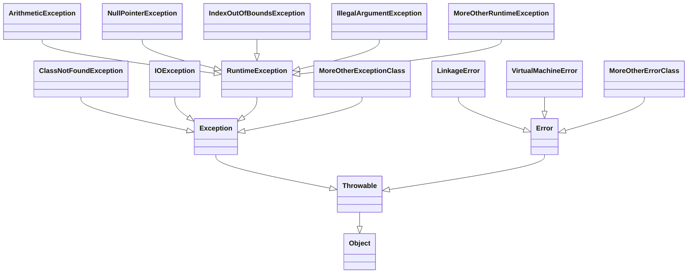
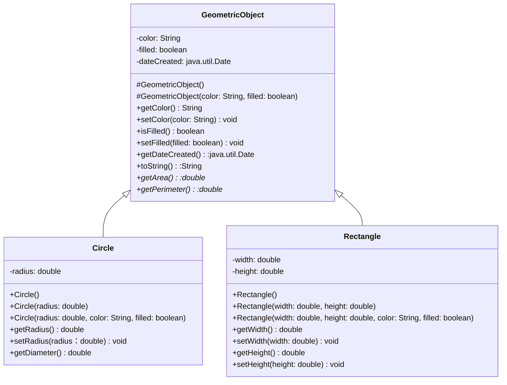
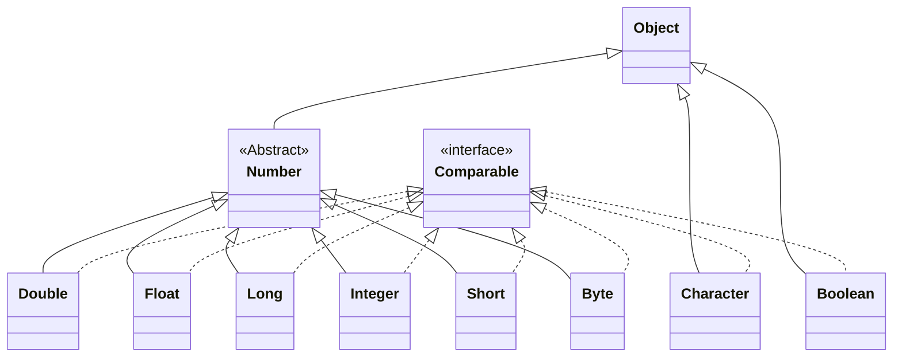
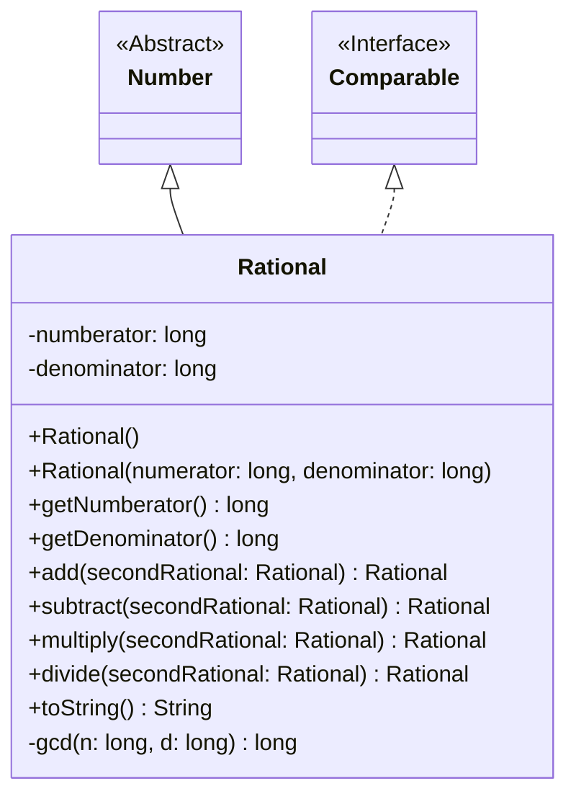
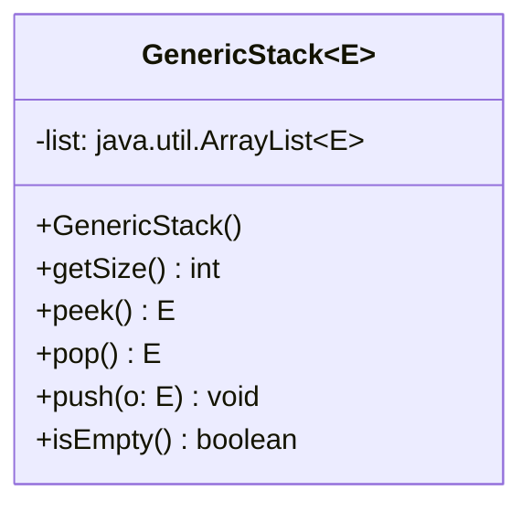
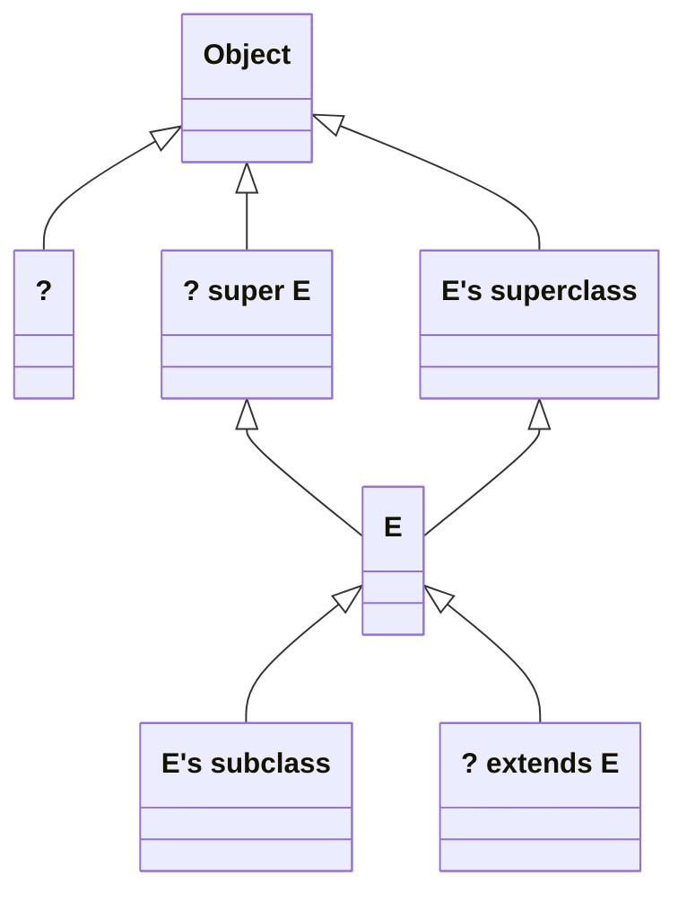

# Java语言程序设计-基础篇
## chapter01
### 1.7 一个简单的java程序
> //程序清单1-1 Welcome.java
```java
public class Welcome {
    public static void main(String[] args) {
        //Display message Welcome to Java! to the console
        System.out.println("Welcome to Java!");
    }
}
```
- 编译运行程序(Windows平台)
```
javac .\Welcome.java
java Welcome
```

`Welcome to Java!`

- 第2行定义了一个类。每个Java程序至少应该有一个类。每个类都有一个名字。按照惯例，类名都是以大写字母开头的。
- 第3行定义主方法(main method)。为了运行某个类，该类必须包含名为main的方法。程序是从main方法开始执行的。

> 程序清单1-2 Welcome1.java
```java
public class Welcome1 {
    public static void main(String[] args) {
        System.out.println("Programming is fun!");
        System.out.println("Fundamentals First");
        System.out.println("Problem Driven");
    }
}
```
反馈
```sh
Programming is fun!
Fundamentals First
Problem Driven
```
> 程序清单1-3 ComputeExpression.java
```java
public class ComputeExpression {
    public static void main(String [] main) {
        System.out.println((10.5 + 2 * 3) / (45 - 3.5));
    }
}
```
反馈
```sh
0.39759036144578314
```

- 1.8 创建、编译和执行Java程序<br>
笔记(略)
- 1.9 (GUI)在消息对话框中显示文本
> 程序清单1-4 WelcomeInMessageDialogBox.java
```java
//This application program displays Welcome to Java! in a message dialog box.
import javax.swing.JOptionPane;

public class WelcomeInMessageDialogBox {
    public static void main(String[] args){
        //Display Welcome to Java! in a message dialog box
        JOptionPane.showMessageDialog(null, "Welcome to Java!");
    }
}
```
反馈<br>


### 编程练习题
- 略

## chapter02 基本程序设计
> 程序清单2-1 ComputeArea.java
```java
public class ComputeArea {
    public static void main(String[] args) {
        double radius;
        double area;

        //Assign a radius
        radius = 20;

        //Compute area
        area = radius * radius * 3.14159;

        //Display results
        System.out.println("The area for the circle of radius " + radius + " is " + area);
    }
}
```
### 2.3 从控制台读取输入
> 程序清单2-2 ComputeAreaWithConsoleInput.java
```java
import java.util.Scanner;

public class ComputeAreaWithConsoleInput {
    public static void main(String[] args) {
        //Create a Scanner object
        Scanner input = new Scanner(System.in);

        //Prompt the user to enter a radius
        System.out.print("Enter a number for radius: ");
        double radius = input.nextDouble();

        //Compute area
        double area = radius * radius * 3.14159;

        //Display result
        System.out.println("The area for the circle of radius " + radius + " is " + area);

        //Close input
        input.close();;
    }
}
```
反馈
```sh
Enter a number for radius: 20
The area for the circle of radius 20.0 is 1256.636
```
- `System.out.print("Enter a number for radius: ")`print方法和println方法类似，两者不同之处在于：当显示完字符串之后，println会将贯标移到下一行，而print不会将光标移到下一行。

> 程序清单2-3 ComputeAverage.java
```java
import java.util.Scanner;

public class ComputeAverage {
    public static void main(String[] args) {
        //Create a Scanner object
        Scanner input = new Scanner(System.in);

        //Prompt the user to enter three numbers
        System.out.print("Enter three number: ");
        double number1 = input.nextDouble();
        double number2 = input.nextDouble();
        double number3 = input.nextDouble();

        //Compute average
        double average = (number1 + number2 + number3) / 3;

        //Display result
        System.out.println("The average of " + number1 + " " + number2 + " " + number3 + " is " +
                            average);
        
        //Input close
        input.close();
    }
}
```
反馈
```sh
Enter three number: 1 2 3
The average of 1.0 2.0 3.0 is 2.0
```
### 2.4 标识符
- 标识符必须遵循一下规则：
    - 标识符是由字母、数字、下划线(_)和美元符号($)构成的字符序列
    - 标识符必须以字母、下划线(_)或美元符号($)开头，不能以数字开头
    - 标识符不能是关键字
    - 标识符不能是true、false或null
    - 标识符可以为任意长度
- 提示
    - 标识符是为了命名变量、常量、方法、类和包。描述性的标识符可提高程序的可读性
    - 不要用字符$命名标识符。习惯上，字符$只用在机器自动产生的源代码中

### 2.5 变量
### 2.6 赋值语句和赋值表达式
### 2.7 常量
`final datatype CONSTANTNAME = VALUE`
### 2.8 数值数据类型及运算
<table border="1"  width="700px" cellspacing="0px">
  <thead align="center">
    <td>类型名</td>
    <td>范围</td>
    <td width="200px">存储大小</td>
  </thead>
  <tbody></tbody>
  <tr>
    <td>byte</td>
    <td>-2<sup>7</sup>(-128) ~ 2<sup>7</sup>-1(127)</td>
    <td>8位带符号数</td>
  </tr>
  <tr>
    <td>short</td>
    <td>-2<sup>15</sup>(-32768) ~ 2<sup>15</sup>-1(32767)</td>
    <td>16位带符号数</td>
  </tr>
  <tr>
    <td>int</td>
    <td>-2<sup>31</sup>(-2147483648) ~ 2<sup>31</sup>-1(2147483647)</td>
    <td>32位带符号数</td>
  </tr>
  <tr>
    <td>long</td>
    <td>-2<sup>63</sup>(-9223372036854775808) ~ 2<sup>63</sup>-1(9223372036854775807)</td>
    <td>64位带符号数</td>
  </tr>
  <tr>
    <td>float</td>
    <td>负数范围:-3.4028235E+38 ~ -1.4E-45<br>正数范围:1.4E-45 ~ 3.4028235E+38</td>
    <td>32位，标准IEEE 754</td>
  </tr>
  <tr>
    <td>double</td>
    <td>负数范围:-1.7976931348623157E+308 ~ -4.9E-324<br>正数范围:4.9E-324 ~ 1.7976931348623157E+308</td>
    <td>64位，标准IEEE 754</td>
  </tr>

</table>

> 程序清单2-4 DisplayTime.java
```java
import java.util.Scanner;

public class DisplayTime {
    public static void main(String[] args) {
        Scanner input = new Scanner(System.in);
        //Prompt the user for input
        System.out.print("Enter an integer of seconds: ");
        int seconds = input.nextInt();

        int minutes = seconds / 60; // Find minutes in seconds
        int remainingSeconds = seconds % 60; // Seconds remaining
        System.out.println(seconds + " seconds is " + minutes + " minutes and " + 
                remainingSeconds + " seconds");
        input.close();
    }    
}
```
反馈
```sh
Enter an integer of seconds: 200
200 seconds is 3 minutes and 20 seconds
```
> 程序清单2-5 FahrenheitToCelsius.java
```java
import java.util.Scanner;

public class FahrenheitToCelsius {
    public static void main(String[] args) {
        Scanner input = new Scanner(System.in);

        System.out.print("Enter a degree in Fahrenheit: ");
        double fahrenheit = input.nextDouble();

        //Convert Fahrenheit to Celsius
        double celsius = (5.0 / 9) * (fahrenheit - 32);
        System.out.println("Fahrenheit " + fahrenheit + " is " + celsius + " in Celsius");
        input.close();;
    }
}
```
反馈
```sh
Enter a degree in Fahrenheit: 100
Fahrenheit 100.0 is 37.77777777777778 in Celsius
```
### 问题：显示当前时间
>程序清单2-6 
```java
public class ShowCurrentTime {
    public static void main(String[] args) {
        //Obtain the total milliseconds since midnight, Jan 1, 1970
        long totalMilliseconds = System.currentTimeMillis();

        //Obtain the total seconds since midnight, Jan 1, 1970
        long totalSeconds = totalMilliseconds / 1000;

        //Compute the current second in the minute in the hour
        long currentSecond = totalSeconds % 60;

        //Obtain the total minutes
        long totalMinutes = totalSeconds / 60;

        //Compute the current minute in the hour
        long currentMinute = totalMinutes % 60;

        //Obtain the total hours
        long totalHours = totalMinutes / 60;

        //Compute the current hour
        long currentHour = totalHours % 24;
        //East 8th District
        currentHour += 8;

        //Display results
        System.out.println("Current time is " + currentHour + ":" + currentMinute
            + ":" + currentSecond + " GMT");
    }
}
```
反馈
```sh
Current time is 13:9:44 GMT
```
### 2.11 数值类型转换
> 程序清单2-7 SalesTax.java
```java
import java.util.Scanner;

public class SalesTax {
    public static void main(String[] args) {
        Scanner input = new Scanner(System.in);

        System.out.print("Enter purchase amount: ");
        double purchaseAmount = input.nextDouble();

        double tax = purchaseAmount * 0.06;
        System.out.println("Sales tax is " + (int)(tax * 100) / 100.0);

        input.close();
    }    
}
```
反馈
```sh
Enter purchase amount: 197.55
Sales tax is 11.85
```
> 程序清单2-8 
```java
public class ComputeLoan {
    public static void main(String[] args) {
        //Create a Scanner
        Scanner input = new Scanner(System.in);

        //Enter yearly interest rate
        System.out.print("Enter yearly interest rate, for example 8.25: ");
        double annualInterestRate = input.nextDouble();

        //Obtain monthly interest rate
        double monthlyInterestRate = annualInterestRate / 1200;

        //Enter number of years
        System.out.print("Enter number of years as an integer, for example 5: ");
        int numberOfYears = input.nextInt();

        //Enter loan amount
        System.out.print("Enter loan amount, for example 120000.95: ");
        double loanAmount = input.nextDouble();

        //Calculate payment
        double monthlyPayment = loanAmount * monthlyInterestRate / (1 - 1 / Math.pow(1 +
            monthlyInterestRate, numberOfYears * 12));
        double totalPayment = monthlyPayment * numberOfYears * 12;

        //Display results
        System.out.println("The monthly payment is " + (int)(monthlyPayment * 100) / 100.0);
        System.out.println("The total payment is " + (int)(totalPayment * 100) / 100.0);

        input.close();
    }
}
```
反馈
```sh
Enter yearly interest rate, for example 8.25: 5.75
Enter number of years as an integer, for example 5: 15
Enter loan amount, for example 120000.95: 250000
The monthly payment is 2076.02
The total payment is 373684.53
```
### 2.13 字符数据类型及运算
> 程序清单2-9 DisplayUnicode.java
```java
import javax.swing.JOptionPane;

public class DisplayUnicode {
    public static void main(String[] args) {
        JOptionPane.showMessageDialog(null, "\u6B22\u8FCE \u03b1 \u03b3", 
            "\u6B22\u8FCE Welcome", JOptionPane.INFORMATION_MESSAGE);
    }
}
```
反馈

### 2.14 问题：挣钱兑零
略
### 2.15 String类型
### 2.16 程序设计风格和文档
- 命名习惯
    - 使用小写字母命名变量和方法。如果一个名字包含多个单词，就将它们连在一起，第一个单词的字母小写，而后面的每个单词的首字母大写；
    - 类名中的每个单词的首字母大写；
    - 大写常量中的所有字母，两个单词间用下划线连接，例如：`MAX_VALUE`
### 2.17 程序设计错误
- 语法错误
- 运行错误
- 逻辑错误
### 2.18 (GUI)从输入对话框获取输入
> 程序清单2-11 
```java
import javax.swing.JOptionPane;

public class ComputeLoanUsingInputDialog {
    public static void main(String[] args) {
        //Enter yearly interest rate
        String annualInterestRateString = JOptionPane.showInputDialog(
            "Enter yearly interest rate, for example 8.25:");
        
        //Convert string to double
        double annualInterestRate = Double.parseDouble(annualInterestRateString);

        //Obtain monthly interest rate
        double monthlyInterestRate = annualInterestRate / 1200;

        //Enter number of years
        String numberOfYearsString = JOptionPane.showInputDialog(
            "Enter number of years as an integer, \nfor example 5:");
        
        //Convert string to int
        int numberOfYears = Integer.parseInt(numberOfYearsString);

        //Enter loan amount
        String loanString = JOptionPane.showInputDialog(
            "Enter loan amount, for example 120000.95:");
        
        //Convert string to double
        double loanAmount = Double.parseDouble(loanString);

        //Calculate payment
        double monthlyPayment = loanAmount * monthlyInterestRate / (1
            - 1 / Math.pow(1 + monthlyInterestRate, numberOfYears * 12));
        double totalPayment = monthlyPayment * numberOfYears * 12;

        //Format to keep two digits after the decimal point
        monthlyPayment = (int)(monthlyPayment * 100) / 100.0;
        totalPayment = (int)(totalPayment * 100) / 100.0;

        //Display results
        String output = "The monthly payment is " + monthlyPayment +
            "\nThe total payment is " + totalPayment;
        JOptionPane.showMessageDialog(null, output);
    }
}
```
反馈<br>略
## 第3章 选择
程序清单3-1 AdditionQuiz.java
```java
import java.util.Scanner;

public class AdditionQuiz {
    public static void main(String[] args) {
        int number1 = (int)(System.currentTimeMillis() % 10);
        int number2 = (int)(System.currentTimeMillis() * 7 % 10);

        // Create a Scanner
        Scanner input = new Scanner(System.in);

        System.out.print("What is " + number1 + " + " + number2 + "? ");

        int answer = input.nextInt();

        System.out.println(number1 + " + " + number2 + " = " + answer +
            " is " + (number1 + number2 == answer));

        input.close();
    }
}
```
反馈
```sh
What is 1 + 7? 6
1 + 7 = 6 is false
```
> 程序清单3-2 SimpleIfDemo.java
```java
import java.util.Scanner;

public class SimpleIfDemo {
    public static void main(String[] args) {
        Scanner input = new Scanner(System.in);
        System.out.println("Enter an integer: ");
        int number = input.nextInt();

        if(number % 5 == 0)
            System.out.println("HiFive");

        if(number % 2 == 0)
            System.out.println("HiEven");
        
        input.close();
    }
}
```
反馈
```sh
Enter an integer:
4
HiEven
```
## chapter04 循环
`todo`
## chapter05 方法
`todo`
## chapter06 一维数组
`todo`
## chapter07 多维数组
`todo`
## chapter08 对象和类
### 8.3 举例：定义类和创建对象
> 程序清单8-1 TestCircle1.java
```java
//Define the circle class with two constructors
class Circle1 {
    double radius;

    /* Construct a circle with radius 1 */
    Circle1() {
        radius = 1.0;
    }

    /* Construct a circle with a specified radius */
    Circle1(double newRadius) {
        radius = newRadius;
    }

    /* Return the area of this circle */
    double getArea() {
        return radius * radius * Math.PI;
    }
}

public class TestCircle1 {
    public static void main(String[] args) {
        //Create a circle with radius 1.0
        Circle1 circle1 = new Circle1();
        System.out.println("The area of the circle of radius "
            + circle1.radius + " is " + circle1.getArea());
        
        //Create a circle with radiu 25
        Circle1 circle2 = new Circle1(25);
        System.out.println("The are of the circle of radius "
            + circle2.radius + " is " + circle2.getArea());
        
        //Create a circle with radius 125
        Circle1 circle3 = new Circle1(125);
        System.out.println("The are of the circle of radius "
            + circle3.radius + " is " + circle3.getArea());
        
        //Modify circle radius
        circle2.radius = 100;
        System.out.println("The are of the circle of radius "
            + circle2.radius + " is " + circle2.getArea());
    }
}
```
反馈
```sh
The area of the circle of radius 1.0 is 3.141592653589793
The are of the circle of radius 25.0 is 1963.4954084936207
The are of the circle of radius 125.0 is 49087.385212340516
The are of the circle of radius 100.0 is 31415.926535897932
```

> 程序清单8-3 TV.java
```java
public class TV {
    int channel = 1;
    int volumeLevel = 1;
    boolean on = false;

    public TV() {
    }

    public void turnOn() {
        on = true;
    }

    public void turnOff() {
        on = false;
    }

    public void setChannel(int newChannel) {
        if(on && newChannel >= 1 && newChannel <= 120)
            channel = newChannel;
    }

    public void setVolume(int newVolumeLevel) {
        if(on && newVolumeLevel >= 1 && newVolumeLevel <= 7)
            volumeLevel = newVolumeLevel;
    }

    public void channelUp() {
        if(on && channel < 120)
            channel++;
    }

    public void channelDown() {
        if(on && channel > 1)
            channel--;
    }

    public void volumeUp() {
        if(on && volumeLevel < 7)
            volumeLevel++;
    }

    public void volumeDown() {
        if(on && volumeLevel > 1)
            volumeLevel--;
    }
}
```
> 程序清单8-4 TestTv.java
```java
public class TestTv {
    public static void main(String[] args) {
        TV tv1 = new TV();
        tv1.turnOn();
        tv1.setChannel(30);
        tv1.setVolume(3);

        TV tv2 = new TV();
        tv2.turnOn();
        tv2.channelUp();
        tv2.channelUp();
        tv2.volumeUp();

        System.out.println("tv1's channel is " + tv1.channel + " and volume level is " + tv1.volumeLevel);
        System.out.println("tv2's channel is " + tv2.channel + " and volume level is " + tv2.volumeLevel);
    }
}
```
反馈
```sh
tv1's channel is 30 and volume level is 3
tv2's channel is 3 and volume level is 2
```
### 8.4 使用构造方法构造对象
- 构造方法是一种特殊的方法。它们有以下三个特殊性
    - 构造方法必须具备和所在类相同的名字
    - 构造方法没有返回类型，甚至连void也没有
    - 构造方法是在创建一个对象使用new操作符时调用的。构造方法的作用是初始化对象。
- 一个类可以不定义构造方法。在这种情况下，类中隐含定义一个方法体为空的无参构造方法。这个构造方法称为默认构造方法，当且仅当类中没有明确定义任何构造方法时才会自动提供它。
8.5 通过引用变量访问对象
- 对象是通过对象引用变量(reference variable)来访问的，该变量包含对对象的引用.
> 程序 清单8-5 
```java
import javax.swing.JFrame;

public class TestFrame {
    public static void main(String[] args) {
        JFrame frame1 = new JFrame();

        frame1.setTitle("Window 1");
        frame1.setSize(200, 150);
        frame1.setLocation(200, 100);
        frame1.setDefaultCloseOperation(JFrame.EXIT_ON_CLOSE);
        frame1.setVisible(true);

        JFrame frame2 = new JFrame();
        frame2.setTitle("Window 2");
        frame2.setSize(200, 150);
        frame2.setLocation(410, 100);
        frame2.setDefaultCloseOperation(JFrame.EXIT_ON_CLOSE);
        frame2.setVisible(true);
    }
}
```
反馈
略
>程序清单8-6 GUIComponents.java
```java
import javax.swing.JButton;
import javax.swing.JCheckBox;
import javax.swing.JComboBox;
import javax.swing.JFrame;
import javax.swing.JLabel;
import javax.swing.JPanel;
import javax.swing.JRadioButton;
import javax.swing.JTextField;

public class GUIComponents {
    public static void main(String[] arg) {
        //Create a button with text OK
        JButton jbtOK = new JButton("ok");

        //Create a button with text Cancel
        JButton jbtCancel = new JButton("Cancel");

        //Create a label with text "Enter your name: "
        JLabel jlblName = new JLabel("Enter your name: ");

        //Create a text field with text "Type Name Here"
        JTextField jtfName = new JTextField("Type Name Here");

        //Create a text field with text "Type Name Here"
        JCheckBox jchkBold = new JCheckBox("Bold");

        //Create a check box with text italic
        JCheckBox jchkItalic = new JCheckBox("Italic");

        //Create a radio button with text red
        JRadioButton jrbRed = new JRadioButton("Red");

        //Create a radio button with text yellow
        JRadioButton jrbYellow = new JRadioButton("Yellow");

        //Create a combo box with several choices
        JComboBox jcboColor = new JComboBox(new String[] {"Freshman", "Sophomore", "Junior", "Senior"});

        //Create a panel to froup components
        JPanel panel = new JPanel();
        panel.add(jbtOK);
        panel.add(jbtCancel);
        panel.add(jlblName);
        panel.add(jtfName);
        panel.add(jchkBold);
        panel.add(jchkItalic);
        panel.add(jrbRed);
        panel.add(jrbYellow);
        panel.add(jcboColor);

        JFrame frame = new JFrame();
        frame.add(panel);
        frame.setTitle("Show GUI Components");
        frame.setSize(450, 100);
        frame.setLocation(200, 100);
        frame.setDefaultCloseOperation(JFrame.EXIT_ON_CLOSE);
        frame.setVisible(true);
    }
}
```
> 程序清单8-7 Circle2.java
```java
public class Circle2 {
    //The radius of the circle
    double radius;

    //The number of objects created
    static int numberOfObjects = 0;

    //Constructt a circle with radius 1
    Circle2() {
        radius = 1.0;
        numberOfObjects++;
    }

    //Construct a circle with a specified radius
    Circle2(double newRadius) {
        radius = newRadius;
        numberOfObjects++;
    }

    //Return numberOfObjects
    static int getNumberOfObjects() {
        return numberOfObjects;
    }

    //Return the area of this circle
    double getArea() {
        return radius * radius * Math.PI;
    }
}
```

> 程序清单8-8 TestCircle2.java
```java
public class TestCircle2 {
    public static void main(String[] args) {
        System.out.println("Before creating objects");
        System.out.println("The number of Circle objects is " + Circle2.numberOfObjects);

        //Create c1
        Circle2 c1 = new Circle2();

        //Display c1 BEFORE c2 is created
        System.out.println("\nAfter creating c1");
        System.out.println("c1: radius (" + c1.radius + ") and number of Circle objects (" +
                c1.numberOfObjects + ")");
        
        //Create c2
        Circle2 c2 = new Circle2(5);

        //Modify c1
        c1.radius = 9;

        //Display c1 and c2 AFTER c2 was created
        System.out.println("\nAfter creating c2 and modifying c1");
        System.out.println("c1: radius (" + c1.radius + ") and number of Circle objects (" + c1.numberOfObjects + ")");
        System.out.println("c2: radius (" + c2.radius + ") and number of Circle objects (" + c2.numberOfObjects + ")");
    }
}
```
反馈
```sh
Before creating objects
The number of Circle objects is 0

After creating c1
c1: radius (1.0) and number of Circle objects (1)

After creating c2 and modifying c1
c1: radius (9.0) and number of Circle objects (2)
c2: radius (5.0) and number of Circle objects (2)
```
### 8.8 可见性修饰符
> 程序清单8-9 Circle3.java
```java
public class Circle3 {
    //The radius of the circle
    private double radius = 1;

    //The number of the objects created
    private static int numberOfObjects = 0;

    //Construct a circle with radius 1
    public Circle3() {
        numberOfObjects++;
    }

    //Construct a circle iwth a specified radius
    public Circle3(double newRadius) {
        radius = newRadius;
        numberOfObjects++;
    }

    //Return radius
    public double getRadius() {
        return radius;
    }

    //Set a new radius
    public void setRadius(double newRadius) {
    radius = (newRadius >= 0) ? newRadius : 0;
    }

    //Return numberOfObjects
    public static int getNumberOfObjects() {
        return numberOfObjects;
    }

    //Return the area of this circle
    public double getArea() {
        return radius * radius * Math.PI;
    }
}
```
> 程序清单8-10 TestCircle3.java
```java
public class TestCircle3 {
    public static void main(String[] args) {
        Circle3 myCircle = new Circle3(5.0);
        System.out.println("The area of the circle of radius " + myCircle.getRadius() + " is " +
            myCircle.getArea());
        
        //Increase myCircle's radius by 10%
        myCircle.setRadius(myCircle.getRadius() * 1.1);
        System.out.println("The area of the circle of radius " + myCircle.getRadius() + " is " +
        myCircle.getArea());
        System.out.println("The number of objects created is " + Circle3.getNumberOfObjects());

    }
}
```
反馈
```sh
The area of the circle of radius 5.0 is 78.53981633974483
The area of the circle of radius 5.5 is 95.03317777109125
The number of objects created is 1
```
> 程序清单8-11 TestPassObject.java
```java
public class TestPassObject {
    public static void main(String[] args) {
        Circle3 myCircle = new Circle3(1);

        //Print areas for radius 1,2,3,4, and 5.
        int n = 5;
        printAreas(myCircle, n);

        //See myCircle.radius and times
        System.out.println("\n" + "Radius is " + myCircle.getRadius());
        System.out.println("n is " + n);
    }

    //Print a table of areas for radius
    public static void printAreas(Circle3 c, int times) {
        System.out.println("Radius \t\tArea");
        while(times >= 1) {
            System.out.println(c.getRadius() + "\t\t" + c.getArea());
            c.setRadius(c.getRadius() + 1);
            times--;
        }
    }
}
```
反馈
```sh
Radius          Area
1.0             3.141592653589793
2.0             12.566370614359172
3.0             28.274333882308138
4.0             50.26548245743669
5.0             78.53981633974483

Radius is 6.0
n is 5
```
> 程序清单8-12 TotalArea.java
```java
public class TotalArea {
    public static void main(String[] args) {
        Circle3[] circleArray = createCircleArray();

        //Print circleArray and total areas of the circles
        printCircleArray(circleArray);
    }

    //Create an array of Circle objects
    public static Circle3[] createCircleArray() {
        Circle3[] circleArray = new Circle3[5];

        for(int i=0; i<circleArray.length; i++) {
            circleArray[i] = new Circle3(Math.random() * 100);
        }

        return circleArray;
    }

    //Print an array of circles and their total area
    public static void printCircleArray(Circle3[] circleArray) {
        System.out.printf("%-30s%-15s\n", "Radius", "Area");
        for(int i=0; i<circleArray.length; i++) {
            System.out.printf("%-30f%-15f\n", circleArray[i].getRadius(), circleArray[i].getArea());
        }

        System.out.println("------------------------------------------");

        //Compute and display the result
        System.out.printf("%-30s%-15f\n", "The total area of circles is", sum(circleArray));
    }

    //Add circle areas
    public static double sum(Circle3[] circleArray) {
        //Initialize sum
        double sum = 0;

        //Add areas to sum
        for(int i=0; i<circleArray.length; i++) {
            sum += circleArray[i].getArea();
        }

        return sum;
    }
}
```
反馈
```sh
Radius                        Area
10.833264                     368.696068
67.971901                     14514.721297
1.996227                      12.518999
18.073652                     1026.222869
21.193995                     1411.157576
------------------------------------------
The total area of circles is  17333.316809
```
## chapter09 字符串和文本I/O
> 程序清单9-1 CheckPalindrome.java
```java
import java.util.Scanner;

public class CheckPalindrome {
    public static void main(String[] args) {
        Scanner input = new Scanner(System.in);

        //Prompt the user to enter a string
        System.out.print("Enter a string: ");
        String s = input.nextLine();

        if(isPalindrome(s))
            System.out.println(s + " is a palindrome");
        else
            System.out.println(s + " is not a palindrome");
        
        input.close();
    }

    //Check if a string is a palindrome
    public static boolean isPalindrome(String s) {
        int low = 0;
        int high = s.length() - 1;

        while(low < high) {
            if(s.charAt(low) != s.charAt(high))
                return false;
            low++;
            high--;
        }

        return true;
    }
}
```
反馈
```sh
Enter a string: moon
moon is not a palindrome
```
> 程序清单9-2 HexToDecimalConversion.java
```java
import java.util.Scanner;

public class HexToDecimalConversion {
    public static void main(String[] args) {
        Scanner input = new Scanner(System.in);

        //Prompt the user to enter a string
        System.out.print("Enter a hex number: ");
        String hex = input.nextLine();

        System.out.println("The decimal value for hex number " + hex + " is " + hexToDecimal(hex.toUpperCase()));
        input.close();
    }

    public static int hexToDecimal(String hex) {
        int decimalValue = 0;
        for(int i=0; i<hex.length(); i++) {
            char hexChar = hex.charAt(i);
            decimalValue = decimalValue * 16 + hexCharToDecimal(hexChar);
        }

        return decimalValue;
    }

    public static int hexCharToDecimal(char ch) {
        if(ch >= 'A' && ch <= 'F')
            return 10 + ch - 'A';
        else
            return ch - '0';
    }
}
```
反馈
```sh
Enter a hex number: af71
The decimal value for hex number af71 is 44913
```
### 9.3 字符类Character
- Java为每一种基本数据类型都提供了一个包装类。这些类是Chaacter\Boolean\Byte\Short\Integer\Long\Float\Double,它们分别对应基本类型char\boolean\byte\short\int\long\float\double。

## chapter10 关于对象的思考
### 10.2 不可变对象和类
- 要使一个类成为不可变的，它必须满足下面的需求
    - 所有数据域都是私有的
    - 没有修改器方法
    - 没有一个访问器方法会返回一个指向可变数据域的引用
### 10.3 变量的作用域
> 程序清单10-1 TestLoanClass.java
```java
import java.util.Scanner;

public class TestLoanClass {
    public static void main(String[] args) {
        // Create a Scanner
        Scanner input = new Scanner(System.in);

        // Enter yearly interest rate
        System.out.print("Enter yearly interest rate, for example, 8.25: ");
        double annualInterestRate = input.nextDouble();

        // Enter number of years
        System.out.print("Enter number of years as an integer: ");
        int numberOfYears = input.nextInt();

        // Enter loan amount
        System.out.print("Enter loan amount, for example, 120000.95: ");
        double loanAmount = input.nextDouble();

        // Create a loan object
        Loan loan = new Loan(annualInterestRate, numberOfYears, loanAmount);

        // Display loan date, monthly payment, and total payment
        System.out.printf("The loan was created on %s\n" + "The monthly payment is %.2f\nThe total payment is %.2f\n",
                loan.getLoanDate().toString(), loan.getMonthlyPayment(), loan.getTotalPayment());

        input.close();
    }
}
```
> 程序清单10-2 Loan.java
```java
public class Loan {
    private double annualInterestRate;
    private int numberOfYears;
    private double loanAmount;
    private java.util.Date loanDate;

    // Default constructor
    public Loan() {
        this(2.5, 1, 1000);
    }

    // Construct a loan with specified annual interest rate, number of years, and
    // loan amount
    public Loan(double annualInterestRate, int numberOfYears, double loanAmount) {
        this.annualInterestRate = annualInterestRate;
        this.numberOfYears = numberOfYears;
        this.loanAmount = loanAmount;
        loanDate = new java.util.Date();
    }

    // Return annualInterestRate
    public double getAnnualInterestRate() {
        return annualInterestRate;
    }

    // Set a new annualInterestRate
    public void setAnnualInterestRate(double annualInterestRate) {
        this.annualInterestRate = annualInterestRate;
    }

    // Return numberOfYears
    public int getNumberOfYears() {
        return numberOfYears;
    }

    // Set a new numberOfYears
    public void setNumberOfYears(int numberOfYears) {
        this.numberOfYears = numberOfYears;
    }

    // Return loanAmout
    public double getLoanAmount() {
        return loanAmount;
    }

    // Set a new loanAmount
    public void setLoanAmount(double loanAmout) {
        this.loanAmount = loanAmout;
    }

    // Find monthly payment
    public double getMonthlyPayment() {
        double monthlyInterestRate = annualInterestRate / 1200;
        double monthlyPayment = loanAmount * monthlyInterestRate
                / (1 - (Math.pow(1 / (1 + monthlyInterestRate), numberOfYears * 12)));
        return monthlyPayment;
    }

    // Find total payment
    public double getTotalPayment() {
        double totalPayment = getMonthlyPayment() * numberOfYears * 12;
        return totalPayment;
    }

    // Return loan date
    public java.util.Date getLoanDate() {
        return loanDate;
    }
}
```
反馈
```sh
Enter yearly interest rate, for example, 8.25: 2.5
Enter number of years as an integer: 5
Enter loan amount, for example, 120000.95: 1000
The loan was created on Tue Jul 16 21:22:27 CST 2024
The monthly payment is 17.75
The total payment is 1064.84
```
### 10.6 面向对象的思考
> 程序清单10-3 UseBMIClass.java
```java
public class UseBMIClass {
    public static void main(String[] args) {
        BMI bmi1 = new BMI("John Doe", 18, 145, 70);
        System.out.println("The BMI for " + bmi1.getName() + " is " + bmi1.getBMI() + " " + bmi1.getStatus());

        BMI bmi2 = new BMI("Peter King", 215, 70);
        System.out.println("The BMI for " + bmi2.getName() + " is " + bmi2.getBMI() + " " + bmi2.getStatus());
    }
}
```
反馈
```sh
The BMI for John Doe is 20.81 normal weight
The BMI for Peter King is 30.85 seriously overweight
```
> 程序清单10-4 BMI.java
```java
public class BMI {
    private String name;
    private int age;
    private double weight; // in pounds
    private double height; // in inches
    public static final double KILOGRAMS_PER_POUND = 0.45359237;
    public static final double METERS_PER_INCH = 0.0254;
    
    public BMI(String name, int age, double weight, double height) {
        this.name = name;
        this.age = age;
        this.weight = weight;
        this.height = height;
    }

    public BMI(String name, double weight, double height) {
        this(name, 20, weight, height);
    }

    public double getBMI() {
        double bmi = weight * KILOGRAMS_PER_POUND / ((height * METERS_PER_INCH) * (height * METERS_PER_INCH));
        return Math.round(bmi * 100) / 100.0;
    }

    public String getStatus() {
        double bmi = getBMI();

        if(bmi < 16)
            return "serious underweight";
        else if(bmi < 18)
            return "underweight";
        else if(bmi < 24)
            return "normal weight";
        else if(bmi < 29)
            return "overweight";
        else if(bmi < 35)
            return "seriously overweight";
        else 
            return "gravely overweight";
    }

    public String getName() {
        return name;
    }

    public int getAge() {
        return age;
    }

    public double getWeight() {
        return weight;
    }

    public double getHeight() {
        return height;
    }
}
```
### 10.7 对象的组合
> 程序清单10-5 TestCourse.java
```java
public class TestCourse {
    public static void main(String[] args) {
        Course course1 = new Course("Data Structures");
        Course course2 = new Course("Database Systems");

        course1.addStudent("Peter Jones");
        course1.addStudent("Brian Smith");
        course1.addStudent("Anne Kennedy");

        course2.addStudent("Peter Jones");
        course2.addStudent("Steve Smith");

        System.out.println("Number of students in course1: " + course1.getNumberOfStudents());
        String[] students = course1.getStudents();
        for(int i=0; i<course1.getNumberOfStudents(); i++)
            System.out.print(students[i] + ", ");
        
        System.out.println();
        System.out.print("Number of students in course2: " + course2.getNumberOfStudents());
    }
}
```
> 程序清单10-6 Course.java
```java
public class Course {
    private String courseName;
    private String[] students = new String[100];
    private int numberOfStudents;

    public Course(String courseName) {
        this.courseName = courseName;
    }

    public void addStudent(String student) {
        students[numberOfStudents++] = student;
    }

    public String[] getStudents() {
        return students;
    }

    public int getNumberOfStudents() {
        return numberOfStudents;
    }

    public String getCourseName() {
        return courseName;
    }

    public void dropStudent(String student) {
        //Left as an exercise in Exercise 10.9
    }
}
```
> 程序清单10-7 TestStackOfIntegers.java
```java
public class TestStackOfIntegers {
    public static void main(String[] args) {
        StackOfIntegers stack = new StackOfIntegers();

        for(int i=0; i<10; i++)
            stack.push(i);

        while(!stack.empty())
            System.out.print(stack.pop() + " ");
    }
}
```
反馈
```sh
9 8 7 6 5 4 3 2 1 0
```
> 程序清单10-8 StackOfIntegers.java
```java
public class StackOfIntegers {
    private int[] elements;
    private int size;
    public static final int DEFAULT_CAPACITY = 16;

    //Construct a stack with the default capacity 16
    public StackOfIntegers() {
        this(DEFAULT_CAPACITY);
    }

    //Construct a stack with the specified maximux capacity
    public StackOfIntegers(int capacity) {
        elements = new int[capacity];
    }

    //Push a new integer into the top of the stack
    public void push(int value) {
        if(size >= elements.length) {
            int[] temp = new int[elements.length * 2];
            System.arraycopy(elements, 0, temp, 0, elements.length);
            elements = temp;
        }

        elements[size++] = value;
    }

    //Return and remove the top element from the stack
    public int pop() {
        return elements[--size];
    }

    //Return the top element from the stack
    public int peek() {
        return elements[size - 1];
    }

    //Test whether the stack is empty
    public boolean empty() {
        return size == 0;
    }

    //Return the number of elements in the stack
    public int getSize() {
        return size;
    }
}
```
> 程序清单10-9 UseGuessDateClass.java
```java
import java.util.Scanner;

public class UseGuessDateClass {
    public static void main(String[] args) {
        int date = 0; //Date to be determined
        int answer;

        //Create a Scanner
        Scanner input = new Scanner(System.in);

        for(int i=0; i<5; i++) {
            System.out.println("Is your birthday in Set" + (i + 1) + "?");
            for(int j=0; j<4; j++) {
                for(int k=0; k<4; k++)
                    System.out.print(GuessDate.getValue(i, j, k) + "  ");
                System.out.println();
            }

            System.out.print("\nEnter 0 for No and 1 for Yes: ");
            answer = input.nextInt();

            if(answer == 1)
                date += GuessDate.getValue(i, 0, 0);
        }

        System.out.println("Your birthday is " + date);

        //Close input steram
        input.close();
    }
}
```
> 程序清单10-10 GuessDate.java
```java
public class GuessDate {    
    private final static int[][][] dates = {
        {   { 1, 3, 5, 7 }, { 9, 11, 13, 15  }, { 17, 19, 21, 23 }, { 25, 27, 29, 31 }  },
        {   { 2, 3, 6, 7 }, { 10, 11, 14, 15 }, { 18, 19, 22, 23 }, { 26, 27, 30, 31 }  },
        {   { 4, 5, 6, 7 }, { 12, 13, 14, 15 }, { 20, 21, 22, 23 }, { 28, 29, 30, 31 }  },
        {   { 8, 9, 10, 11},{ 12, 13, 14, 15 }, { 24, 25, 26, 27 }, { 28, 29, 30, 31 }  },
        { { 16, 17, 18, 19},{ 20, 21, 22, 23 }, { 24, 25, 26, 27 }, { 28, 29, 30, 31 }  }
    };
    
    //Prevent the user frm creating objects from GuessDate
    private GuessDate() {   }

    //Return a date at the specified row and column in a given set
    public static int getValue(int setNo, int k, int j) {
        return dates[setNo][k][j];
    }
}
```
### 10.11 类的设计原则
- 内聚性
    - 类应该描述一个单一的实体，而所有的类操作应该在逻辑上相互配合，支持一个连贯性的目标
- 一致性
    - 遵循标准Java程序设计风格和命名习惯。给类、数据域和方法选择有信息量的名字。流行的风格是将数据声明置于构造方法之前，并且将构造方案置于方法之前
    - 应该一律提供一个为构造默认实例的公共无参构造方法。如果一个类不支持无参构造方法，要用文档写出原因。如果没有显示定义构造方法，就假定有一个空方法体的公共默认无参构造方法。
    - 如果不想让用户创建类的对象，可以在类中声明一个私有的构造方法
- 封装性
    - 一个类应该使用private修饰符隐藏其数据，以免用户直接访问它。这使得类更易于维护。
- 清晰性
    - 为使设计清晰，内聚性、一致性和封装性都是很好的设计原则。除此之外，类应该有一个很清晰的合约，易于解释和理解。
- 完整性
    - 类经常是为许多不同用户的使用而设计的。一个类应该通过属性和方法提供多种方案以适应用户的不同需求

- 注意
    构造方法永远都是实例方法，因为它是用来创建具体实例的。一个静态变量或方法可以从实例方法中调用，但是不能从静态方法中调用实例变量或方法

## chapter11 继承和多态
> 程序清单11-1 GeometricObject1.java
```java
public class GeometricObject1 {
    private String color = "white";
    private boolean filled;
    private java.util.Date dateCreated;

    //Construct a default geometric object
    public GeometricObject1() {
        dateCreated = new java.util.Date();
    }

    //Construct a geometric object with the specified color
    public GeometricObject1(String color, boolean filled) {
        dateCreated = new java.util.Date();
        this.color = color;
        this.filled = filled;
    }

    //Return color
    public String getColor() {
        return color;
    }

    //Set a new color
    public void setColor(String color) {
        this.color = color;
    }

    //Return filled.Since filled is boolean its get method is named is Filled
    public boolean isFilled() {
        return filled;
    }

    //Set a new filled
    public void setFilled(boolean filled) {
        this.filled = filled;
    }

    //Get dateCreated
    public java.util.Date getDateCreated() {
        return dateCreated;
    }

    //Return a string representation of this object
    public String toString() {
        return "created on " + dateCreated + "\ncolor: " + color + " and filled: " + filled;
    }
}
```
> 程序清单11-2 Circle4.java
```java
public class Circle4 extends GeometricObject1 {
    private double radius;

    public Circle4() {  }
    public Circle4(double radius) { this.radius = radius; }
    public Circle4(double radius, String color, boolean filled) {
        this.radius = radius;
        setColor(color);
        setFilled(filled);
    }

    public double getRadius() { return radius; }

    //Set a new radius
    public void setRadius(double radius) { this.radius = radius; }

    //Return area
    public double getArea() { return radius * radius * Math.PI; }

    //Return diameter
    public double getDiameter() { return 2 * radius; }

    //Return perimeter
    public double getPerimeter() { return 2 * radius * Math.PI; }

    //Print the circle info
    public void printCircle() {
        System.out.println("The circle is created " + getDateCreated() + " and the radius is " + radius);
    }
}
```
> 程序清单11-3 Rectangle1.java
```java
public class Rectangle1 extends GeometricObject1 {
    private double width;
    private double height;

    public Rectangle1() {   }
    public Rectangle1(double width, double height) {
        this.width = width;
        this.height = height;
    }

    public Rectangle1(double width, double height, String color, boolean filled) {
        this.width = width;
        this.height = height;
        setColor(color);
        setFilled(filled);
    }

    //Return width
    public double getWidth() {
        return width;
    }

    //Set a new width
    public void setWidth(double width) {
        this.width = width;
    }

    //Return height
    public double getHeight() {
        return height;
    }

    //Set a new height
    public void setHeight(double height) {
        this.height = height;
    }

    //Return area
    public double getArea() {
        return width * height;
    }

    //Return perimeter
    public double getPerimeter() {
        return 2 * (width + height);
    }
}
```
> 程序清单11-4 TestCircleRectangle.java
```java
public class TestCircleRectangle {
    public static void main(String[] args) {
        Circle4 circle = new Circle4(1);

        System.out.println("A circle " + circle.toString());
        System.out.println("The radius is " + circle.getRadius());
        System.out.println("The area is " + circle.getArea());
        System.out.println("The diameter is " + circle.getDiameter());

        Rectangle1 rectangle = new Rectangle1(2, 4);
        System.out.println("\nA rectangle " + rectangle.toString());
        System.out.println("The area is " + rectangle.getArea());
        System.out.println("The perimeter is " + rectangle.getPerimeter());
    }
}
```
反馈
```sh
A circle created on Wed Jul 17 13:15:40 CST 2024
color: white and filled: false
The radius is 1.0
The area is 3.141592653589793
The diameter is 2.0

A rectangle created on Wed Jul 17 13:15:40 CST 2024
color: white and filled: false
The area is 8.0
The perimeter is 12.0
```
### 11.3 使用super关键字
- 关键字super可以用于两种途径:
    - 调用父类的构造方法
    - 调用父类的方法
- 警告：要调用父类构造方法就必须使用关键字super,而且这个调用必须是构造方法的第一条语句。在子类中调用父类构造方法的名字会引起一个语法错误
- 注意：构造方法可用来构造一个类的实例。不像属性和方法，父类的构造方法是不被子类继承的。它们只能从子类的构造方法中用关键字super调用
- 设计指南：最好能为每个类提供一个无参构造方法(如果需要的话)，以便于对该类进行扩展同时避免错误
### 11.4 覆盖方法
- 使用super.xxx()访问已经触发重写的父类方法是错误的原因如下：
    - 仅当实例方法是可访问时，它才能被覆盖。因为私有方法在它的类本身以外是不能访问的，所以它不能被覆盖。如果子类中定义的方法在父类中是私有的，那么这两个方法完全没有关系
    - 与实例方法一样，静态方法也能被继承。但是 静态方法不能被覆盖。如果父类中定义的静态方法在子类中被重新定义，那么定义在父类中的静态方法将被隐藏。可以使用语法：SuperClassName.staticMehodName调用隐藏的静态方法
### 11.6 对象类Object和它的toStrin()方法
- Java中的每个类都源于java.lang.Object类。
### 11.7 多态
- 继承关系使一个子类继承父类的特征，并且附加一些新特征。子类是它的父类的特殊化，每个子类的实例都是其父类的实例，但是反过来就不成立。例如：每个圆都是一个集合对象，但并非每个几何对象都是圆。
> 程序清单11-5 PolymorphismDemo.java
```java
public class PolymorphismDemo {
    public static void main(String[] args) {
        //Display circle and rectangle properties
        displayObject(new Circle4(1, "red", false));
        displayObject(new Rectangle1(1, 1, "black", true));
    }

    //Display geometric object properties
    public static void displayObject(GeometricObject1 object) {
        System.out.println("Created on " + object.getDateCreated() + ". Color is " + object.getColor());
    }
}
```
反馈
```sh
Created on Wed Jul 17 14:02:57 CST 2024. Color is red
Created on Wed Jul 17 14:02:57 CST 2024. Color is black
```
### 11.8 动态绑定
- 一个方法可以在父类中定义而在它的子类中覆盖。
- 两个重要术语：声明类型和实际类型
    - 一个变量必须被声明为某种类型。变量的这个类型称为它的声明类型(declared type)。一个引用类型变量可以是一个null值或者是一个对声明类型实例的引用。实例可以使用声明类型或它的子类型的构造方法创建。变量的实际类型(actual type)是被变量引用的对象的实际类。

> 程序清单11-6 DynamicBindingDemo.java
```java
public class DynamicBindingDemo {
    public static void main(String[] args) {
        m(new GraduateStudent());   //Student
        m(new Student());           //Student
        m(new Person());            //Person
        m(new Object());            //java.lang.Object@15db9742
    }

    public static void m(Object x) {
        System.out.println(x.toString());
    }
    
}
class GraduateStudent extends Student {}
class Student extends Person {
    public String toString(){ return "Student"; }
}
class Person extends Object {
    public String toString() {
        return "Person";
    }
}
```
反馈
```sh
Student
Student
Person
java.lang.Object@15db9742
```
### 11.9 对象转换和instanceof运算符
> 程序清单11-7 CastingDemo.java
```java
public class CastingDemo {
    public static void main(String[] args) {
        //Create and initialize two objects
        Object object1 = new Circle4(1);
        Object object2 = new Rectangle1(1, 1);

        //Display circle and rectangle
        displayObject(object1);
        displayObject(object2);

    }

    //A method for displaying an object
    public static void displayObject(Object object) {
        if(object instanceof Circle4) {
            System.out.println("The circle area is " + ((Circle4)object).getArea());
            System.out.println("The circle diameter is " + ((Circle4)object).getDiameter());
        }else if(object instanceof Rectangle1) {
            System.out.println("The rectangle area is " + ((Rectangle1)object).getArea());
        }
    }
}
```
反馈
```sh
The circle area is 3.141592653589793
The circle diameter is 2.0
The rectangle area is 1.0
```
### 11.10 Object的equals方法
- `public boolean equals(Object o)`这个实现使用==运算符检测两个引用变量是否指向同一个对象。因此，应该在自己的客户类中覆盖这个方法，以测试两个不用的对象是否具有相同的内容
- 可以使用equals方法比较两个字符串。String类中的equals方法继承自Object类，然后在String类中被覆盖，使之能够检验两个字符串的内容是否相等。可以覆盖Circle类中的equals方法，基于圆的半径比较两个圆是否相等参考代码如下：
```java
public boolean equals(Object o) {
    if(o instanceof Circle) {
        return radius == ((Circle)o).radius;
    }else {
        return false;
    }
}
```
### 11.11 数组线性表ArrayList类
> 程序清单11-8 
```java
public class TestArrayList {
    public static void main(String[] args) {
        //Create a list to store cities
        java.util.ArrayList cityList = new java.util.ArrayList();

        //Add some cities in the list
        cityList.add("London");
        cityList.add("Denver");
        cityList.add("Paris");
        cityList.add("Miami");
        cityList.add("Seoul");
        cityList.add("Tokyo");

        System.out.println("List size ? " + cityList.size());
        System.out.println("Is Miami in the list? " + cityList.contains("Miami"));
        System.out.println("The location of Denver in the list? " + cityList.indexOf("Denver"));
        System.out.println("Is the list empty? " + cityList.isEmpty());

        cityList.add(2, "Xian");
        cityList.remove("Miami");
        cityList.remove(1);

        System.out.println(cityList.toString());

        for(int i=cityList.size() - 1; i>=0; i--)
            System.out.print(cityList.get(i) + " ");
        System.out.println();

        java.util.ArrayList list = new java.util.ArrayList();
        list.add(new Circle4(2));
        list.add(new Circle4(3));

        System.out.println("The area of the circle? " + ((Circle4)list.get(0)).getArea());
    }
}
```
反馈
```sh
List size ? 6
Is Miami in the list? true
The location of Denver in the list? 1
Is the list empty? false
[London, Xian, Paris, Seoul, Tokyo]
Tokyo Seoul Paris Xian London
The area of the circle? 12.566370614359172
```
> 程序清单11-9 MyStack.java
```java
public class MyStack {
    private java.util.ArrayList list = new java.util.ArrayList();

    public boolean isEmpty() {
        return list.isEmpty();
    }

    public int getSize() {
        return list.size();
    }

    public Object peek() {
        return list.get(getSize() - 1);
    }

    public Object pop() {
        Object o = list.get(getSize() - 1);
        list.remove(getSize() - 1);
        return o;
    }

    public void push(Object o) {
        list.add(o);
    }

    public int search(Object o) {
        return list.lastIndexOf(o);
    }

    //Override the toString in the Object class
    public String toString() {
        return "stack: " + list.toString();
    }
}
```
### 11.13 protected数据和方法
- 经常需要允许子类访问定义在父类中的数据域或方法，但不允许非子类访问这些数据域和方法。可以使用关键字protected完成该功能。父类中被保护的数据域或方法可以在它的子类中访问
- private、protected、public都称为可见性修饰符或可访问性修饰符，因为它们指定如何访问类和类成员。

- 表11-2 数据和方法的可见性
<table border="1"  width="700px" cellspacing="0px">
  <thead align="center">
    <td>类中成员的修饰符</td>
    <td>在同一类内可访问</td>
    <td>在同一包内可访问</td>
    <td>在子类内可访问</td>
    <td>在不同包可访问</td>
  </thead>
  <tbody ></tbody>
  <tr align="center">
    <td >private</td>
    <td >&#x2714</td>
    <td>&#x2716</td>
    <td>&#x2716</td>
    <td>&#x2716</td>
  </tr>
  <tr align="center">
    <td>(default)</td>
    <td>&#x2714</td>
    <td>&#x2714</td>
    <td>&#x2716</td>
    <td>&#x2716</td>
  </tr>
  <tr align="center">
    <td>protected</td>
    <td>&#x2714</td>
    <td>&#x2714</td>
    <td>&#x2714</td>
    <td>&#x2716</td>
  </tr>
  <tr align="center">
    <td>public</td>
    <td>&#x2714</td>
    <td>&#x2714</td>
    <td>&#x2714</td>
    <td>&#x2714</td>
  </tr>
</table>

- 类的使用方式有2种：
    - 创建该类的实例
    - 通过扩展该类创建它的子类
- 如果不想从类外使用类的成员，就把成员声明成private
- 如果想让该类的用户都能使用类的成员，就把成员声明成public
- 如果想让该类的扩展者使用数据和方法，而不想让该类的用户使用，则把成员声明成protected
- 修饰符private和protected只能用于类的成员
- 修饰符public和default既可以用于类成员，同样也可以用于类。一个没有修饰符的累(即非公共类)是不能被其他包中的类访问的

11.14 防止扩展和覆盖
- 有时候，可能希望防止类扩展,使用final修饰符表明一个类是终极的，是不能作为父级的:
```java
public final class C {
    //Data fields, constructors, and methods omitted
}
```
```java
public class Test {
    //Data fields, constructors, and methods omitted
    public final void method() {
        //Do something
    }
}
```
## chapter12 图形用户界面基础
*omitted*
## chapter13 异常处理
### 13.2 异常处理概述
> 程序清单13-1 Quotient.java
```java
import java.util.Scanner;

public class Quotient {
    public static void main(String[] args) {
        Scanner input = new Scanner(System.in);

        //Prompt the user to enter two integers
        System.out.print("Enter two integers: ");
        int number1 = input.nextInt();
        int number2 = input.nextInt();

        System.out.println(number1 + " / " + number2 + " is " + (number1 / number2));

        input.close();
    }
}
```
反馈
```sh
Enter two integers: 3 0
Exception in thread "main" java.lang.ArithmeticException: / by zero
        at base.chapter13.Quotient.main(Quotient.java:13)
```
> 程序清单13-2 QuotientWithIf.java
```java
import java.util.Scanner;

public class QuotientWithIf {
    public static void main(String[] args) {
        Scanner input = new Scanner(System.in);

        //Prompt the user to enter two integers
        System.out.print("Enter two integers: ");
        int number1 = input.nextInt();
        int number2 = input.nextInt();

        if(number2 != 0) {
            System.out.println(number1 + " / " + number2 + " is " + (number1 / number2));
        }else {
            System.out.println("Divisor cannot be zero ");
        }

        input.close();
    }
}
```
反馈
```sh
Enter two integers: 5 0
Divisor cannot be zero
```
> 程序清单13-3 QuotientWithException.java
```java
import java.util.Scanner;

public class QuotientWithException {
    public static void main(String[] args) {
        Scanner input = new Scanner(System.in);

        //Prompt the user to enter two integers
        System.out.println("Enter two integers: ");
        int number1 = input.nextInt();
        int number2 = input.nextInt();

        try {
            if(number2 == 0)
                throw new ArithmeticException("Divisor cannot be zero");
            
            System.out.println(number1 + " / " + number2 + " is " + (number1 / number2));
        }catch (ArithmeticException ex) {
            System.out.println("Exception: an integer " + "cannot be divided by zero ");
        }

        System.out.println("Execution continues ...");
        input.close();
    }
}
```
反馈
```sh
Enter two integers:
5 0
Exception: an integer cannot be divided by zero
Execution continues ...
```
### 13.3 异常处理的优势
> 程序清单13-4 
```java
import java.util.Scanner;

public class QuotientWithMethod {
    public static int quotient(int number1, int number2) {
        if(number2 == 0)
            throw new ArithmeticException("Divisor cannot be zero");
        
        return number1 / number2;
    }

    public static void main(String[] args) {
        Scanner input = new Scanner(System.in);

        //Prompt the user to enter two integers
        System.out.print("Enter two integers: ");
        int number1 = input.nextInt();
        int number2 = input.nextInt();

        try {
            int result = quotient(number1, number2);
            System.out.println(number1 + " / " + number2 + " is " + result);
        }catch (ArithmeticException ex) {
            System.out.println("Exception: an integer " + "cannot be divided by zero ");
        }

        System.out.println("Exception continues ...");
        input.close();
    }
}
```
反馈
```sh
Enter two integers: 5 0
Exception: an integer cannot be divided by zero
Exception continues ...
```
> 程序清单13-5 FileNotFoundExceptionDemo.java
```java
import java.util.Scanner;
import java.io.*;

public class FileNotFoundExceptionDemo {
    public static void main(String[] args) {
        Scanner inputFromConsole = new Scanner(System.in);
        System.out.print("Enter a file name: ");
        String filename = inputFromConsole.nextLine();
        Scanner inputFromFile = null;

        try {
            inputFromFile = new Scanner(new File(filename));
            System.out.println("File " + filename + " exists ");
            //Processing file ...
        }catch(FileNotFoundException ex) {
            System.out.println("Exception: " + filename + " not found");
        }

        if(inputFromFile != null)
            inputFromFile.close();
        inputFromConsole.close();
    }
}
```
反馈
```sh
Enter a file name: f:testFile.txt
Exception: f:testFile.txt not found
```
> 程序清单13-6 InputMismatchExceptionDemo.java
```java
import java.util.*;

public class InputMismatchExceptionDemo {
    public static void main(String[] args) {
        Scanner input = new Scanner(System.in);
        boolean continueInput = true;

        do{
            try {
                System.out.print("Enter an integer: ");
                int number = input.nextInt();

                //Display the result
                System.out.println("The number entered is " + number);
                continueInput = false;
            }catch(InputMismatchException ex) {
                System.out.println("Try again. (" + "Incorrect input: an integer is required)");
                input.nextLine(); // Discard input
            }
        }while(continueInput);

        input.close();
    }
}
```
反馈
```sh
Enter an integer: 3.6
Try again. (Incorrect input: an integer is required)
Enter an integer: 5
The number entered is 5
```
### 13.4 异常类型

- Throwable类是所有异常类的根。所有的Java异常类都直接或者间接地继承自Throwable。可以通过扩展Exception或者Exception地子类来创建自己的异常类。异常类分为三种如下：
    - 系统错误(system error)是由Java虚拟机抛出的，用Error类表示。Error类描述的是内部系统错误。这样的错误很少发生。如果发生，除了通知用户以及尽量稳妥地终止程序外，几乎什么也不能做。
    - 异常(exception)是用Exception类表示地，它描述地是由程序和外部环境所引起地错误，这些错误能被程序捕获和处理。
    - 运行时异常(runtime exception)是用RuntimeException类表示的，它描述的是程序设计错误，例如：错误的类型转换、访问一个越界数组或数值错误。
### 13.5 关于异常处理的更多知识
- Java的异常处理模型基于三种操作：
    - 声明一个异常(declaring an exception)
    - 抛出一个异常(throwing an exception)
    - 捕获一个异常(catching an exception)
> 程序清单13-7 TestException.java
```java
public class TestException {
    public static void main(String[] args) {
        try {
            System.out.println(sum(new int[] {1,2,3,4,5}));
        }catch(Exception ex) {
            ex.printStackTrace();
            System.out.println("\n" + ex.getMessage());
            System.out.println("\n" + ex.toString());

            System.out.println("\nTrance Info Obtained from getStackTrace");
            StackTraceElement[] traceElements = ex.getStackTrace();
            for(int i=0; i<traceElements.length; i++) {
                System.out.print("method " + traceElements[i].getMethodName());
                System.out.print("(" + traceElements[i].getClassName() + ":");
                System.out.println(traceElements[i].getLineNumber() + ")");
            }
        }
    }

    private static int sum(int[] list) {
        int result = 0;
        for(int i=0; i<=list.length; i++) {
            result += list[i];
        }

        return result;
    }
}
```
反馈
```sh
java.lang.ArrayIndexOutOfBoundsException: 5
        at base.chapter13.TestException.sum(TestException.java:25)
        at base.chapter13.TestException.main(TestException.java:6)

5

java.lang.ArrayIndexOutOfBoundsException: 5

Trance Info Obtained from getStackTrace
method sum(base.chapter13.TestException:25)
method main(base.chapter13.TestException:6)
```
> 程序清单13-8 CircleWithException.java
```java
public class CircleWithException {
    private double radius;
    private static int numberOfObjects = 0;

    //Construct a circle with radius 1
    public CircleWithException() {
        this(1.0);
    }

    //Construct a circle with a spcified radius
    public CircleWithException(double newRadius) {
        setRadius(newRadius);
        numberOfObjects++;
    }

    //Return radius
    public double getRadius() {
        return radius;
    }

    //set a new radius
    public void setRadius(double newRadius) throws IllegalArgumentException {
        if(newRadius >= 0)
            radius = newRadius;
        else
            throw new IllegalArgumentException("Radius cannot be negative");
    }

    //Return numberOfObjects
    public static int getNumberOfObjects() {
        return numberOfObjects;
    }

    //Return the area of this circle
    public double findArea() {
        return radius * radius * 3.14159;
    }
}
```
> 程序清单13-9 TestCircleWithException.java
```java
public class TestCircleWithException {
    public static void main(String[] args) {
        try {
            CircleWithException c1 = new CircleWithException(5);
            CircleWithException c2 = new CircleWithException(-5);
            CircleWithException c3 = new CircleWithException(0);
        } catch (IllegalArgumentException ex) {
            System.out.println(ex);
        }

        System.out.println("Number of objects created: " + CircleWithException.getNumberOfObjects());
    }
}
```
反馈
```sh
java.lang.IllegalArgumentException: Radius cannot be negative
Number of objects created: 1
```
### 13.6 finally子句
- finally子句的语法示例:
```java
try {
    statements;
}catch (TheException ex) {
    handling ex;
}finally {
    finalStatements;
}
```
- 在任何情况下，finally块中的代码都会执行，不论try块中是否出现异常或者是否被捕获。
    1. 如果try块中没有出现异常，执行finalStatements,然后执行try语句的下一条语句；
    2. 如果try块中有一条语句会引起异常，并被catch块捕获，然后跳过try块的其他语句，执行catch块和finally子句。执行try语句之后的下一条语句；
    3. 如果try块中有一条语句引起异常，但是没有被任何catch块捕获，就会跳过try块中的其他语句，执行finally子句，并且将异常传递给这个方法的调用者；
    4. 即使在到达finally块之前有一个return语句，finally块还是会执行。
> 程序清单13-10 FinallyDemo.java
```java
public class FinallyDemo {
    public static void main(String[] args) {
        java.io.PrintWriter output = null;

        try {
            //Create a file
            output = new java.io.PrintWriter("text.txt");

            //Write formatted output to the file
            output.println("Welcome to Java");
        }catch(java.io.IOException ex) {
            ex.printStackTrace();
        }finally {
            //Close the file
            if(null != output)
                output.close();
        }

        System.out.println("End of program");
    }
}
```
### 13.7 何时使用异常
- 当必须处理不可预料的错误状况时应该使用它。不要用try-catch块处理简单的、可预料的情况。
### 13.8 重新抛出异常
- 如果异常处理器没有处理某异常，或者处理器只希望它的调用者注意到该异常，Java就允许异常处理器重新抛出该异常如：
```java
try {
    statements;
}catch(TheException ex) {
    perform operation before exits;
    throw ex;
}
```
- 语句throw ex重新抛出异常给调用者，以便调用者的其他处理器获得处理异常ex的机会。
### 13.9 链式异常
- 有时候，可能需要同原始异常一起抛出一个新异常(带有附加信息)。这称为链式异常(chained exception)。
程序清单13-11 
```java
public class ChainedExceptionDemo {
    public static void main(String[] args) {
        try {
            method1();
        }catch (Exception ex) {
            ex.printStackTrace();
        }
    }

    public static void method1() throws Exception {
        try {
            method2();
        }catch (Exception ex) {
            throw new Exception("New info from method1", ex);
        }
    }

    public static void method2() throws Exception {
        throw new Exception("New info from method2");
    }
}
```
反馈
```sh
java.lang.Exception: New info from method1
        at base.chapter13.ChainedExceptionDemo.method1(ChainedExceptionDemo.java:16)
        at base.chapter13.ChainedExceptionDemo.main(ChainedExceptionDemo.java:6)
Caused by: java.lang.Exception: New info from method2
        at base.chapter13.ChainedExceptionDemo.method2(ChainedExceptionDemo.java:21)
        at base.chapter13.ChainedExceptionDemo.method1(ChainedExceptionDemo.java:14)
        ... 1 more
```
13.10 创建自定制异常类
> 程序清单13-12 InvalidRadiusException.java
```java
public class InvalidRadiusException extends Exception {
    private double radius;

    //Construct an exception
    public InvalidRadiusException(double radius) {
        super("Invalid radius " + radius);
        this.radius = radius;
    }

    //Return the radius
    public double getRadius() {
        return radius;
    }
}
```
- 提示：可以扩展RuntimeException声明一个自定制异常类吗？可以，但这不是一个好方法，因为这会使自定制异常成为免检的。最好使自定制异常必检，这样，编译器就可以在程序中强制捕获这些异常。

## chapter14 抽象类和接口
### 14.2 抽象类
> UML

- 抽象类和常规类很像，但是不能使用new操作符创建它的实例。抽象方法只有定义而没有实现。它的实现由子类提供。一个包含抽象方法的类必须声明为抽象类。
- 抽象类的构造方法定义为protected,因为它只被子类使用。创建一个具体子类的实例时，它的父类的构造方法被调用以初始化父类中定义的数据域
- 抽象类GeometricObject为几何对象定义了共同特征(数据和方法)，并且提供了正确的构造方法。
> 程序清单14-1 GeometricObject.java
```java
public abstract class GeometricObject {
    private String color = "white";
    private boolean filled;
    private java.util.Date dateCreated;

    //Construct a default geometric object
    protected GeometricObject() {
        dateCreated = new java.util.Date();
    }

    //Construct a geometric object with color and filled value
    protected GeometricObject(String color, boolean filled) {
        dateCreated = new java.util.Date();
        this.color = color;
        this.filled = filled;
    }

    //Return color
    public String getColor() {
        return color;
    }

    //Set a new color
    public void setColor(String color) {
        this.color = color;
    }

    //Return filled.Since filled is boolean, the get method is named isFilled
    public boolean isFilled() {
        return filled;
    }

    //Set a new filled
    public void setFilled(boolean filled) {
        this.filled = filled;
    }

    //Get dateCreated
    public java.util.Date getDateCreated() {
        return dateCreated;
    }

    //Return a string representation of this object
    public String toString() {
        return "created on" + dateCreated + "\ncolor: " + color + " and filled: " + filled;
    }

    //Abstract method getArea
    public abstract double getArea();

    //Abstract method getPerimeter
    public abstract double getPerimeter();
}
```
> 程序清单14-2 Circle.java
```java
public class Circle extends GeometricObject {
    //Same as lines 2-46 in Listing 11.2, so omitted
}
```
> 程序清单14-3 Rectangle.java
```java
public class Rectangle extends GeometricObject {
    //Same as lines 2-49 in Listing 11.3, so omitted
}
```
> 程序清单14-4 TestGeometricObject.java
```java
public interface TestGeometricObject {
    public static void main(String[] args) {
        GeometricObject geoObject1 = new Circle(5);
        GeometricObject geoObject2 = new Rectangle(5, 3);

        System.out.println("The two objects have the same area? " + equalArea(geoObject1, geoObject2));

        //Display circle
        displayGeometricObject(geoObject1);

        //Display rectangle
        displayGeometricObject(geoObject2);
    }

    //A method for comparing the areas of two geometric objects
    public static boolean equalArea(GeometricObject object1, GeometricObject object2) {
        return object1.getArea() == object2.getArea();
    }

    //A method for displaying a geometric object
    public static void displayGeometricObject(GeometricObject object) {
        System.out.println();
        System.out.println("The area is " + object.getArea());
        System.out.println("The perimeter is " + object.getPerimeter());
    }
}
```
反馈
```sh
The two objects have the same area? false

The area is 78.53981633974483
The perimeter is 31.41592653589793

The area is 15.0
The perimeter is 16.0
```
- 关于抽象类值得注意的几点:
    - 抽象方法不能包含在非抽象类中。如果抽象父类的子类不能实现所有的抽象方法，那么子类也必须定义为抽象的。换句话说，在抽象类扩展的非抽象子类中，必须实现所有的抽象方法。还要注意到，抽象方法是非静态的；
    - 抽象类是不能使用new操作符来实例化对象的。但是，仍然可以定义它的构造方法，这个构造方法在它的子类的构造方法中调用；
    - 包含抽象对象的类必须是抽象的。但是，可以定义一个不包含抽象方法的抽象类。在这种情况下，不能使用new操作符创建该类的实例。这种类是用来定义新子类的基类的；
    - 即使子类的父类是具体的，这个子类也可以是抽象的。例如：Object类是具体的，但是它的子类如GeometricObject可以是抽象的；
    - 子类可以覆盖父类的方法并将它定义为abstract。很少见，但是它在当父类的方法实现在子类中变得不合法时很有用的。在这种情况下，子类必须定义为abstract。
    - 不能使用new操作符从一个抽象类创建一个实例，但是抽象类可以用作一种数据类型。

> 程序清单14-5 TestCalendar.java
```java
import java.util.*;

public class TestCalendar {
    public static void main(String[] args) {
        //Construct a Gregorian calendar for the current date and time
        Calendar calendar = new GregorianCalendar();

        System.out.println("Current time is " + new Date());
        System.out.println("YEAR:\t" + calendar.get(Calendar.YEAR));
        System.out.println("MONTH:\t" + calendar.get(Calendar.MONTH));
        System.out.println("DATE:\t" + calendar.get(Calendar.DATE));
        System.out.println("HOUR:\t" + calendar.get(Calendar.HOUR));
        System.out.println("HOUR_OF_DAY:\t" + calendar.get(Calendar.HOUR_OF_DAY));
        System.out.println("MINUTE:\t" + calendar.get(Calendar.MINUTE));
        System.out.println("SECOND:\t" + calendar.get(Calendar.SECOND));
        System.out.println("DAY_OF_WEEK:\t" + calendar.get(Calendar.DAY_OF_WEEK));
        System.out.println("DAY_OF_MONTH:\t" + calendar.get(Calendar.DAY_OF_MONTH));
        System.out.println("DAY_OF_YEAR:\t" + calendar.get(Calendar.DAY_OF_YEAR));
        System.out.println("WEEK_OF_MONTH:\t" + calendar.get(Calendar.WEEK_OF_MONTH));
        System.out.println("WEEK_OF_YEAR:\t" + calendar.get(Calendar.WEEK_OF_MONTH));
        System.out.println("AM_PM:\t" + calendar.get(Calendar.AM_PM));

        //Construct a calendar for September 11, 2001
        Calendar calendar1 = new GregorianCalendar(2001, 8, 11);
        System.out.println("September 11, 2001 is a " + dayNameOfWeek(calendar1.get(Calendar.DAY_OF_WEEK)));
    }

    public static String dayNameOfWeek(int dayOfWeek) {
        switch(dayOfWeek) {
            case 1: return "Sunday";
            case 2: return "Monday";
            case 3: return "Tuesday";
            case 4: return "Wednesday";
            case 5: return "Thursday";
            case 6: return "Friday";
            case 7: return "Saturday";
            default: return null;
        }
    }
}
```
反馈
```sh
Current time is Thu Jul 18 14:34:56 CST 2024
YEAR:   2024
MONTH:  6
DATE:   18
HOUR:   2
HOUR_OF_DAY:    14
MINUTE: 34
SECOND: 56
DAY_OF_WEEK:    5
DAY_OF_MONTH:   18
DAY_OF_YEAR:    200
WEEK_OF_MONTH:  3
WEEK_OF_YEAR:   3
AM_PM:  1
September 11, 2001 is a Tuesday
```
### 14.4 接口
- 接口(interface)是一种与类相似的结构，只包含常量和抽象方法。接口在许多方面都与抽象类很相似，但是它的目的是指明多个对象的共同行为。例如，使用正确的接口，可以指明这些对象是可比较的、可食用的或可克隆的。语法示例如下：
```java
修饰符 interface 接口名 {
    //常量声明
    //方法签名
}
```
程序清单14-6 TestEdible.java
```java
public class TestEdible {
    public static void main(String[] args) {
        Object[] objects = { new Tiger(), new Chicken(), new Apple() };

        for(int i=0; i<objects.length; i++) {
            if(objects[i] instanceof Edible) {
                System.out.println(((Edible)objects[i]).howToEat());
            }
        }
    }
}

class Animal { /* omitted */ }

class Chicken extends Animal implements Edible {
    public String howToEat() {
        return "Chicken: Fry it";
    }
}

class Tiger extends Animal {  }

abstract class Fruit implements Edible {
    //Data fields, constructors, and methods omitted here
}

class Apple extends Fruit {
    public String howToEat() {
        return "Apple: Make apple cider";
    }
}

class Orange extends Fruit {
    public String howToEat() {
        return "Orange: Make orange juice";
    }
}
```
反馈
```sh
Chicken: Fry it
Apple: Make apple cider
```
- 注意：由于接口中所有的数据域都是public final static而且所有的方法都是public abstract,所以Java允许忽略这些修饰符;
```java
public interface T {
    public static final int K = 1;
    public abstract void p();
}
```
> 程序清单14-7 ComparableRectangle.java
```java
public class ComparableRectangle extends Rectangle implements Comparable {
    //Construct a ComparableRectangle with specified properties
    public ComparableRectangle(double width, double height) {
        super(width, height);
    }

    //Implement the compareTo method defined in Comparable
    public int compareTo(Object o) {
        if(getArea() > ((ComparableRectangle)o).getArea())
            return 1;
        else if(getArea() < ((ComparableRectangle)o).getArea())
            return -1;
        else
            return 0;
    }
}
```
> 程序清单14-8 HandleEvent.java
```java
import javax.swing.*;
import java.awt.event.*;

public class HandleEvent extends JFrame {
    public HandleEvent() {
        //Create two buttons
        JButton jbtOK = new JButton("OK");
        JButton jbtCancel = new JButton("Cancel");

        //Create a panel to hold buttons
        JPanel panel = new JPanel();
        panel.add(jbtOK);
        panel.add(jbtCancel);

        add(panel);

        //Register listeners
        OKListenerClass listener1 = new OKListenerClass();
        CancelListenerClass listener2 = new CancelListenerClass();
        jbtOK.addActionListener(listener1);
        jbtCancel.addActionListener(listener2);
    }

    public static void main(String[] args) {
        JFrame frame = new HandleEvent();

        frame.setTitle("Handle Event");
        frame.setSize(200, 150);
        frame.setLocation(200, 100);
        frame.setDefaultCloseOperation(JFrame.EXIT_ON_CLOSE);
        frame.setVisible(true);
    }

    class OKListenerClass implements ActionListener {
        public void actionPerformed(ActionEvent e) {
            System.out.println("OK button clicked");
        }
    }

    class CancelListenerClass implements ActionListener {
        public void actionPerformed(ActionEvent e) {
            System.out.println("Cancel button clicked");
        }
    }
}
```
### 14.7 举例：Cloneable接口
- 标记接口:一个带空体的接口称为标记接口(marker interface)。一个标记接口既不包括常量也不包括方法。它用来表示一个类拥有某些特定的熟悉。实现Cloneable接口的类标记为可克隆的，而且它的对象可以使用在Object类中定义的clone()方法克隆。<br>
`public interface Cloneable {   }`
> 程序清单14-9 House.java
```java
public class House implements Cloneable, Comparable {
    private int id;
    private double area;
    private java.util.Date whenBuilt;

    public House(int id, double area) {
        this.id = id;
        this.area = area;
        whenBuilt = new java.util.Date();
    }

    public int getId() { return id; }
    public double getArea() { return area; }
    public java.util.Date getWhenBuilt() { return whenBuilt; }
    
    //Override the protected clone method defined in the Object class, and strengthen its accessibility
    public Object clone() throws CloneNotSupportedException {
        return super.clone();
    }

    //Implement the compareTo method defined in Comparable
    public int compareTo(Object o) {
        if(area > ((House)o).area)
            return 1;
        else if(area < ((House)o).area)
            return -1;
        else
            return 0;
    }
}
```
### 14.8 接口与抽象类
<table border="1"  width="700px" cellspacing="0px">
  <thead align="center">
    <td>Item</td>
    <td>变量</td>
    <td>构造方法</td>
    <td>类方法</td>
  </thead>
  <tbody></tbody>
  <tr>
    <td>抽象类</td>
    <td>无限制</td>
    <td>子类通过构造方法链调用构造方法，抽象类不能用new操作符实例化</td>
    <td>无限制</td>
  </tr>
  <tr>
    <td>接口</td>
    <td>所有变量必须是public static final</td>
    <td>没有构造方法。<br>接口不能用new操作符实例化</td>
    <td>所有方法必须是公共的抽象实例方法</td>
  </tr>
</table>
- 注意：类名是一个名词。接口可以是形容词或名词。示例：
    - java.lang.Comparable [形容词]
    - java.awt.event.ActionListener [名词]
- 设计指南：抽象类和接口都是用来明确多个对象的共同特征的。那么该如何确定在声明情况下应该使用接口，声明情况下应该使用类呢？
    - (strong is-a relationship)应该用类建模。
    - (weak is-a relationship)or(is-kind-of relationship),它表明对象拥有某种属性。可以用接口来建模。

14.9 将基本数据类型值作为对象处理
- Java 为基本数据类型提供了Boolean、Character、Double、Float、Byte、Short、Integer和Long等。
> UML

### 14.10 举例：对一个对象数组排序
> 程序清单14-10 GenericSort.java
```java
public class GenericSort {
    public static void main(String[] args) {
        //Create an Integer array
        Integer[] intArray = { new Integer(2), new Integer(4), new Integer(3) };

        //Create a Double array
        Double[] doubleArray = { new Double(3.4), new Double(1.3), new Double(-22.1) };

        //Create a Character array
        Character[] charArray = { new Character('a'), new Character('J'), new Character('r') };

        //Create a String array
        String[] stringArray = { "Tom", "John", "Fred" };

        //Sort the arrays
        sort(intArray);
        sort(doubleArray);
        sort(charArray);
        sort(stringArray);

        //Display the sorted arrays
        System.out.print("Sorted Integer objects: ");
        printList(intArray);
        System.out.print("Sorted Double objects: ");
        printList(doubleArray);
        System.out.print("Sorted Character objects: ");
        printList(charArray);
        System.out.print("Sorted String objects: ");
        printList(stringArray);
    }

    //Sort an array of comparable objects
    public static void sort(Comparable[] list) {
        Comparable currentMin;
        int currentMinIndex;

        for(int i=0; i<list.length - 1; i++) {
            //Find the maximum in the list[0..i]
            currentMin = list[i];
            currentMinIndex = i;

            for(int j=i+1; j<list.length; j++) {
                if(currentMin.compareTo(list[j]) > 0) {
                    currentMin = list[j];
                    currentMinIndex = j;
                }
            }

            //Swap list[i] with list[currentMinIndex] if necessary
            if(currentMinIndex != i) {
                list[currentMinIndex] = list[i];
                list[i] = currentMin;
            }
        }
    }

    //Print an array of objects
    public static void printList(Object[] list) {
        for(int i=0; i<list.length; i++) {
            System.out.print(list[i] + " ");
        }
        System.out.println();
    }
}
```
反馈
```sh
Sorted Integer objects: 2 3 4
Sorted Double objects: -22.1 1.3 3.4
Sorted Character objects: J a r
Sorted String objects: Fred John Tom
```
### 14.11 基本类型和包装类型之间的自动转换
- Java允许基本类型和包装类型之间进行自动转换。
`Integer intObject = new Integer(2);` 等价于 `Integer intObject = 2;`

### 14.12 BigInteger和BigDecimal类
> 程序清单14-11 LargeFactorial.java
```java
import java.math.BigInteger;

public class LargeFactorial {
    public static void main(String[] args) {
        System.out.println("50! is \n" + factorial(50));
    }

    public static BigInteger factorial(long n) {
        BigInteger result = BigInteger.ONE;
        for(int i = 1; i<=n; i++)
            result = result.multiply(new BigInteger(i + ""));
        
        return result;
    }
}
```
反馈
```sh
50! is
30414093201713378043612608166064768844377641568960512000000000000
```
### 14.13 实例学习：Raional类
> UML

> 程序清单14-12 TestRationalClass.java
```java
public class TestRationalClass {
    public static void main(String[] args) {
        //Create and initialize two rational numbers r1 and r2
        Rational r1 = new Rational(4, 2);
        Rational r2 = new Rational(2, 3);

        //Display results
        System.out.println(r1 + " + " + r2 + " = " + r1.add(r2));
        System.out.println(r1 + " - " + r2 + " = " + r1.subtract(r2));
        System.out.println(r1 + " * " + r2 + " = " + r1.multiply(r2));
        System.out.println(r1 + " / " + r2 + " = " + r1.divide(r2));
        System.out.println(r2 + " is " + r2.doubleValue());
    }
    
}
```
反馈
```sh
2 + 2/3 = 8/3
2 - 2/3 = 4/3
2 * 2/3 = 4/3
2 / 2/3 = 3
2/3 is 0.6666666666666666
```
> 程序清单14-13 Rational.java
```java
public class Rational extends Number implements Comparable {
    //Data fields for numerator and denominator
    private long numerator = 0;
    private long denominator = 1;

    //Construct a rational with default properties
    public Rational() { this(0, 1); }

    //Construct a rational with specified numerator and denominator
    public Rational(long numerator, long denominator) {
        long gcd = gcd(numerator, denominator);
        this.numerator = ((denominator > 0) ? 1 : -1) * numerator / gcd;
        this.denominator = Math.abs(denominator) / gcd;
    }

    //Find GCD of two numbers
    private static long gcd(long n, long d) {
        long n1 = Math.abs(n);
        long n2 = Math.abs(d);
        int gcd = 1;

        for(int k=1; k<=n1 && k<=n2; k++) {
            if(n1%k == 0 && n2%k == 0)
                gcd = k;
        }

        return gcd;
    }

    //Return numerator
    public long getNumerator() { return numerator; }

    //Return denominator
    public long getDenominator() { return denominator; }

    //Add a rational number to this rtional
    public Rational add(Rational secondRational) {
        long n = numerator * secondRational.getDenominator() + denominator * secondRational.getNumerator();
        long d = denominator * secondRational.getDenominator();
        
        return new Rational(n, d);
    }

    //Substract a rational number from this rational
    public Rational subtract(Rational secondRational) {
        long n = numerator * secondRational.getDenominator() - denominator * secondRational.getNumerator();
        long d = denominator * secondRational.getDenominator();
        
        return new Rational(n, d);
    }

    //Multiply a rational number to this rational
    public Rational multiply(Rational secondRational) {
        long n = numerator * secondRational.getNumerator();
        long d = denominator * secondRational.getDenominator();

        return new Rational(n, d);
    }

    //Divide a rational number from this rational
    public Rational divide(Rational secondRational) {
        long n = numerator * secondRational.getDenominator();
        long d = denominator * secondRational.getNumerator();

        return new Rational(n, d);
    }

    //Override the toString() method
    public String toString() {
        if(denominator == 1)
            return numerator + "";
        else
            return numerator + "/" + denominator;
    }

    //Override the equals method in the Object class
    public boolean equals(Object parml) {
        if((this.subtract((Rational)parml)).getNumerator() == 0)
            return true;
        else 
            return false;
    }

    //Implement the abstract intValue method in java.lang.Number
    public int intValue() { return (int)doubleValue(); }

    //Implement the abstract floatValue method in java.lang.Number
    public float floatValue() { return (float)doubleValue(); }

    //Implement the doubleValue method in java.lang.Number
    public double doubleValue() { return numerator * 1.0 / denominator; }

    //Implement the abstract longValue method in java.lang.Number
    public long longValue() { return (long)doubleValue(); }

    //Implement the compareTo method in java.lang.Comparable
    public int compareTo(Object o) {
        if((this.subtract((Rational)o)).getNumerator() > 0) {
            return 1;
        }else if ((this.subtract((Rational)o)).getNumerator() < 0)
            return -1;
        else
            return 0;
    }
}
```
# chapter15 图形
*omitted*
## chapter16 事件驱动程序设计
*omitted*
## chapter17 创建图形用户界面
*omitted*
## chapter18 applet和多媒体
*omitted*
## chapter19 二进制I/O
**TODO**
## chapter20 递归
*omitted*
## chapter21 泛型
### 21.1 引言
- 泛型(generic)是指参数化类型的能力。可以定义带泛型类型的类或方法，随后编译器会用具体的类型来替换它。
- 使用泛型的主要优点是能够在编译时而不是在运行时检测出错误。
### 21.2 动机和优点
- 泛型可以进行数据类型检测，在编译期间发现问题
- 避免类型转换具备自动打包和自动解包的能力
### 21.3 定义泛型类和接口
> UML

> 程序清单21.1 GenericStack.java
```java
public class GenericStack<E> {
    private java.util.ArrayList<E> list = new java.util.ArrayList<E>();

    public int getSize() { return list.size(); }
    public E peek() { return list.get(getSize() - 1); }
    public void push(E o) { list.add(o); }
    public E pop() {
        E o = list.get(getSize() - 1);
        list.remove(getSize() - 1);

        return o;
    }
    public boolean isEmpty() { return list.isEmpty(); }
}
```
### 21.4 泛型方法
> 程序清单21.2 GenericMethodDemo.java
```java
public class GenericMethodDemo {
    public static void main(String[] args) {
        Integer[] integers = { 1, 2, 3, 4, 5 };
        String[] strings = { "London", "Paris", "New York", "Austin" };

        GenericMethodDemo.<Integer>print(integers);
        GenericMethodDemo.<String>print(strings);
    }

    public static <E> void print(E[] list) {
        for(int i=0; i<list.length; i++)
            System.out.print(list[i] + " ");
        System.out.println();
    }
}
```
> 程序清单21.3 BoundedTypeDemo.java
```java
import base.chapter14.*;

public class BoundedTypeDemo {
    public static void main(String[] args) {
        Rectangle rectangle = new Rectangle(2, 2);
        Circle circle = new Circle(2);

        System.out.println("Same area? " + BoundedTypeDemo.<GeometricObject>equalArea(rectangle, circle));
    }

    public static <E extends GeometricObject> boolean equalArea(E object1, E object2) {
        return object1.getArea() == object2.getArea();
    }
}
```
反馈
```sh
Same area? false
```
- 注意：非受限泛型类型<E>和<E extends Object>是一样的
- 注意：为了定义一个类为泛型类型，需要将泛型类型放在类名之后，例如`GenericStack<E>`
- 注意：为了定义一个方法为泛型类型，需要将泛型类型放在方法返回类型之前，例如`<E> void max(E o1, E o2)`
### 21.5 原始类型和向后兼容
- 可以使用泛型类而无需指定具体类型，以下2个示例等价
    - `GenericStack stack = new GenericStack();`
    - `GenericStack<Object> stack = new GenericStack<Object>()`
> 程序清单21.4 Max.java
```java
public class Max {
    //Return the maximum between two objects
    public static Comparable max(Comparable o1, Comparable o2) {
        if(o1.compareTo(o2) > 0)
            return o1;
        else
            return o2;
    }
}
```
- Comparable o1 和Comparable o2都是原始类型声明。原始类型是不安全的。一个更好的例子见下：
> 程序清单21.5 Max1.java
```java
public class Max1 {
    //Return the maximum between two objects
    public static <E extends Comparable<E>> E max(E o1, E o2) {
        if(o1.compareTo(o2) > 0)
            return o1;
        else
            return o2;
    }
}
```
### 21.6 统配泛型
- 通配泛型是什么？为什么需要统配泛型？见程序清单21.6
> 程序清单21.6 WildCardDemo1.java
```java
public class WildCardDemo1 {
    public static void main(String[] args) {
        GenericStack<Integer> intStack = new GenericStack<Integer>();
        intStack.push(1);
        intStack.push(2);
        intStack.push(-2);

        //System.out.println("The max number is " + max(intStack));
        /* Use up bounded wildcard */
        System.out.println("The max number is " + max(intStack));
    }

    //Find the maximum in a stack of numbers
    public static double max(GenericStack<? extends Number> stack) {
        double max = stack.pop().doubleValue(); //Initialize max

        while(!stack.isEmpty()) {
            double value = stack.pop().doubleValue();
            if(value > max)
                max = value;
        }

        return max;
    }
}
```
反馈
```sh
The max number is 2.0
```
- `System.out.println("The max number is " + max(intStack));`会出现编译错误，因为intStack不是GenericStack<number>的实例。所以不能调用max(intStack)。
- 尽管Integer是Number的子类型，但是，GenericStack<Integer>并不是GenericStack<Number>的子类型。为了避免这个问题，可以使用通配泛型类型。通配泛型类型有三种形式:
    - `?`<================>非受限通配(unbounded wildcard) 和 `? extends Object`是一样的
    - `? extends T`<======>T称为受限通配(bounded wildcard),表示T或T的一个未知子类型
    - `？super T`<========>T称为下限通配(lower-bound wildcard),表示或T的一个未知夫类型
> 程序清单21.7 WildCardDemo2.java
```java
public class WildCardDemo2 {
    public static void main(String[] args) {
        GenericStack<Integer> intStack = new GenericStack<Integer>();
        intStack.push(1);
        intStack.push(2);
        intStack.push(-2);

        print(intStack);
    }

    //Prints objects and empties the stack
    public static void print(GenericStack<?> stack) {
        while(!stack.isEmpty()) {
            System.out.print(stack.pop() + " ");
        }
    }
}
```
反馈
```sh
-2 2 1
```
> 程序清单21.8 WildCardDemo3.java
```java
public class WildCardDemo3 {
    public static void main(String[] args) {
        GenericStack<String> stack1 = new GenericStack<String>();
        GenericStack<Object> stack2 = new GenericStack<Object>();

        stack2.push("Java");
        stack2.push(2);
        stack1.push("Sun");
        add(stack1, stack2);
        WildCardDemo2.print(stack2);
    }

    public static <T> void add(GenericStack<T> stack1, GenericStack<? super T> stack2) {
        while(!stack1.isEmpty())
            stack2.push(stack1.pop());
    }
}
```
反馈
```sh
Sun 2 Java
```
- 泛型类型和通配类型之间的继承关系如下：

### 21.7 消除泛型和对泛型的限制
- 泛型是使用一种称为类型消除(type erasure)的方法来实现的。编译器使用泛型类型信息来编译代码，但是随后会消除它。因此，泛型信息在运行时是不可用的。这种方法可以使泛型代码向后兼容使用原始类型的遗留代码。
- 泛型存在于编译时。一旦编译器确认泛型类型是安全使用的，就会将它转换为原始类型。
- 限制
    1. 不能使用new E()
    2. 不能使用new E[]
    3. 在静态环境下不允许类的参数是泛型类型
    4. 异常类不能是泛型的 
### 21.8 实例学习：泛型矩阵类
> 程序清单21.9 GenericMatrix.java
```java
public abstract class GenericMatrix<E extends Number> {
    //Abstract method for adding two elements of the matrices
    protected abstract E add(E o1, E o2);

    //Abstract method for multiplying two elements of the matrices
    protected abstract E multiply(E o1, E o2);

    //Abstract method for defining zero for the matrix element
    protected abstract E zero();

    //Add two matrices
    public E[][] addMatrix(E[][] matrix1, E[][] matrix2) {
        //Check bounds of the two matrices
        if((matrix1.length != matrix2.length) || (matrix1[0].length != matrix2.length)) {
            throw new RuntimeException("The matrices do not have the same size");
        }

        E[][] result = (E[][])new Number[matrix1.length][matrix1[0].length];

        //Perform addition
        for(int i=0; i<result.length; i++) {
            for(int j=0; j<result[i].length; j++) {
                result[i][j] = add(matrix1[i][j], matrix2[i][j]);
            }
        }

        return result;
    }

    //Multiply two matrices
    public E[][] multiplyMatrix(E[][] matrix1, E[][] matrix2) {
        //Check bounds
        if(matrix1[0].length != matrix2.length) {
            throw new RuntimeException("The matrices donot have compatible size");
        }

        //Create result matrix
        E[][] result = (E[][])new Number[matrix1.length][matrix2[0].length];

        //Perform multiplication of two matrices
        for(int i=0; i<result.length; i++){
            for(int j=0; j<result[0].length; j++) {
                result[i][j] = zero();

                for(int k=0; k<matrix1[0].length; k++) {
                    result[i][j] = add(result[i][j], multiply(matrix1[i][k], matrix2[k][j]));
                }
            }
        }

        return result;
    }

    //Print matrices, the operator, and therir operation result
    public static void printResult(Number[][] m1, Number[][] m2, Number[][] m3, char op) {
        for(int i=0; i<m1.length; i++) {
            for(int j=0; j<m1[0].length; j++) {
                System.out.print(" " + m1[i][j]);
            }

            if(i == m1.length / 2)
                System.out.print(" " + op + " ");
            else
                System.out.print("    ");
            
            for(int j=0; j<m2.length; j++)
                System.out.print(" " + m2[i][j]);
            
            if(i == m1.length / 2)
                System.out.print("  =  ");
            else
                System.out.print("    ");
            
            for(int j=0; j<m3.length; j++)
                System.out.print(m3[i][j] + " ");
            
            System.out.println();
        }
    }
}
```
> 程序清单21.10 IntegerMatrix.java
```java
public class IntegerMatrix extends GenericMatrix<Integer> {
    //Implement the add method for adding two matrix elements
    protected Integer add(Integer o1, Integer o2) {
        return o1 + o2;
    }

    //Implement the multiply method for multiplying two matrix elements
    protected Integer multiply(Integer o1, Integer o2) {
        return o1 * o2;
    }

    //Implement the zero method to specify zero for Integer
    protected Integer zero() { return 0; }
}
```
> 程序清单21.11 RationalMatrix.java
```java
import base.chapter14.*;

public class RationalMatrix extends GenericMatrix<Rational> {
    //Implement the add method for adding two rational elements
    protected Rational add(Rational r1, Rational r2) { return r1.add(r2); }

    //Implement the multiply method for multiplying two rational elements
    protected Rational multiply(Rational r1, Rational r2) { return r1.multiply(r2); }

    //Implement the zero method to specify zero for Rational
    protected Rational zero() { return new Rational(0, 1); }
}
```
> 程序清单21.12 TestIntegerMatrix.java
```java
public class TestIntegerMatrix {
    public static void main(String[] args) {
        //Create Integer arrays m1, m2
        Integer[][] m1 = new Integer[][] {{1,2,3}, {4,5,6},{1,1,1}};
        Integer[][] m2 = new Integer[][] {{1,1,1}, {2,2,2},{0,0,0}};

        //Create an instance of IntegerMatrix
        IntegerMatrix integerMatrix = new IntegerMatrix();

        System.out.println("\nm1 + m2 is ");
        GenericMatrix.printResult(m1, m2, integerMatrix.addMatrix(m1, m2), '+');

        System.out.println("\nm1 * m2 is ");
        GenericMatrix.printResult(m1, m2, integerMatrix.multiplyMatrix(m1, m2), '*');
    }
}
```
反馈
```sh
m1 + m2 is
 1 2 3     1 1 1    2 3 4
 4 5 6 +  2 2 2  =  6 7 8
 1 1 1     0 0 0    1 1 1

m1 * m2 is
 1 2 3     1 1 1    5 5 5
 4 5 6 *  2 2 2  =  14 14 14
 1 1 1     0 0 0    3 3 3
```
> 程序清单21.13 TestRationalMatrix.java
```java
import base.chapter14.Rational;

public class TestRationalMatrix {
    public static void main(String[] args) {
        //Create two Rational arrays m1 and m2
        Rational[][] m1 = new Rational[3][3];
        Rational[][] m2 = new Rational[3][3];

        for(int i=0; i<m1.length; i++) {
            for(int j=0; j<m1[0].length; j++) {
                m1[i][j] = new Rational(i + 1, j + 5);
                m2[i][j] = new Rational(i + 1, j + 6);
            }
        }

        //Create an instance of RationalMatrix
        RationalMatrix rationalMatrix = new RationalMatrix();
        System.out.println("\nm1 + m2 is ");
        GenericMatrix.printResult(m1, m2, rationalMatrix.addMatrix(m1, m2), '+');

        System.out.println("\nm1 * m2 is ");
        GenericMatrix.printResult(m1, m2, rationalMatrix.multiplyMatrix(m1, m2), '*');
    }
}
```
反馈
```sh
m1 + m2 is
 1/5 1/6 1/7     1/6 1/7 1/8    11/30 13/42 15/56
 2/5 1/3 2/7 +  1/3 2/7 1/4  =  11/15 13/21 15/28
 3/5 1/2 3/7     1/2 3/7 3/8    11/10 13/14 45/56

m1 * m2 is
 1/5 1/6 1/7     1/6 1/7 1/8    101/630 101/735 101/840
 2/5 1/3 2/7 *  1/3 2/7 1/4  =  101/315 202/735 101/420
 3/5 1/2 3/7     1/2 3/7 3/8    101/210 101/245 101/280
```


## chapter22 Java集合框架
*omitted*